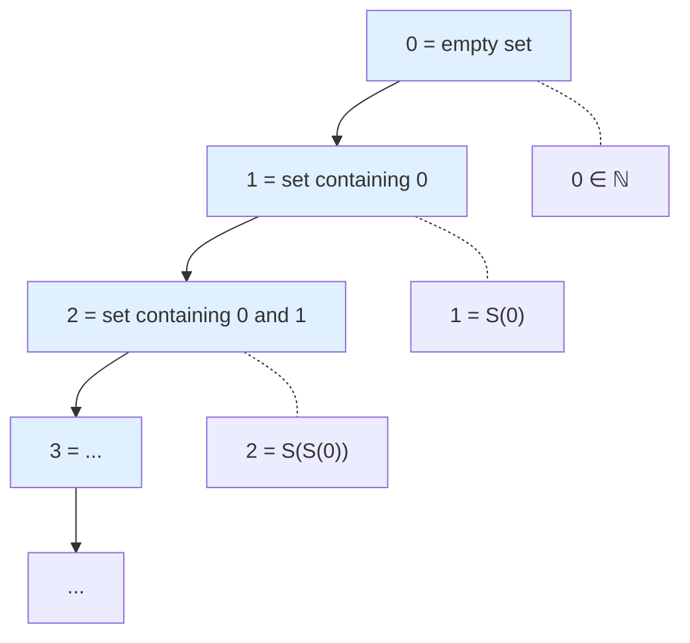
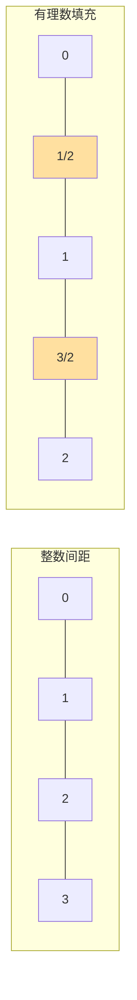
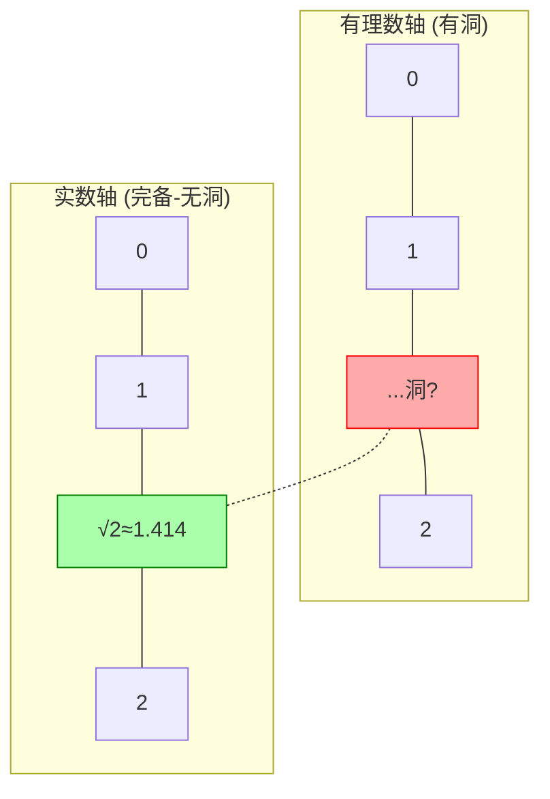
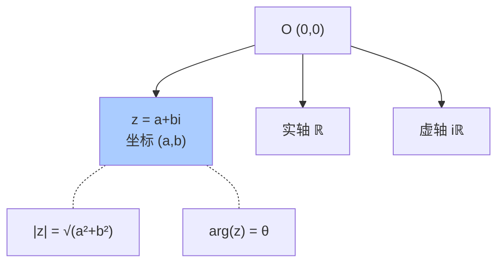
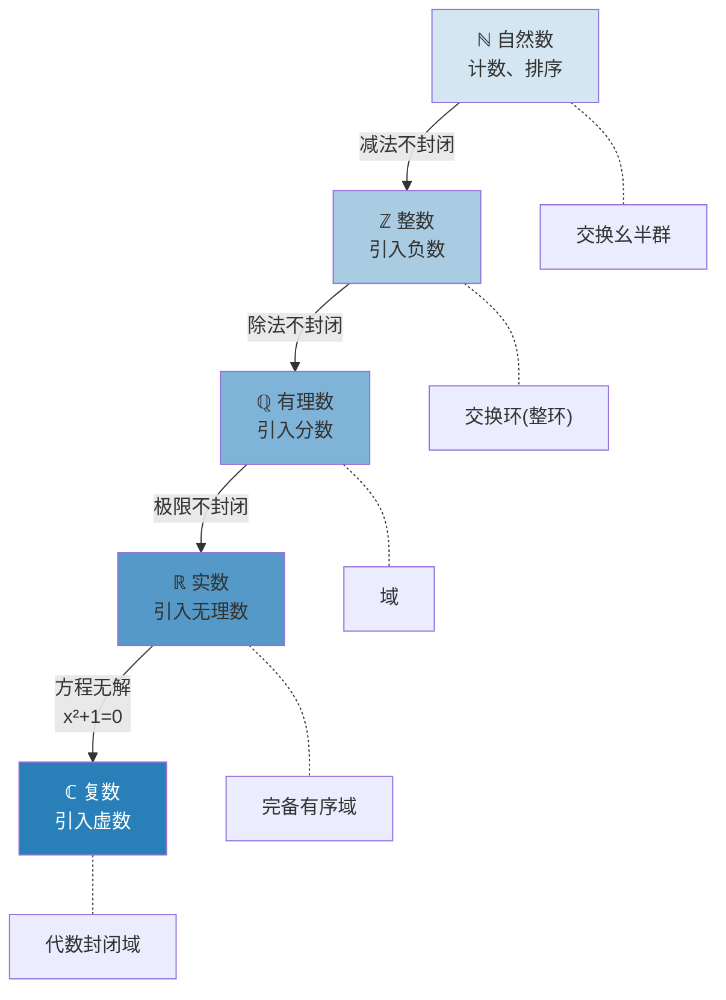

# 第1章 数与数系

> 从计数石子到量子态的复数——数是人类理解宇宙最底层的语言。本章沿着数系的逐级扩张路线，揭示每一次"不够用"的危机如何推动数学的革命性突破。

---

## 1.1 自然数 $\mathbb{N}$

### 定义：Peano 公理系统

1889年，皮亚诺用五条公理精确定义了自然数：

1. $0$ 是自然数
2. 每个自然数 $n$ 有一个**后继** $S(n)$
3. $0$ 不是任何自然数的后继
4. 若 $S(m) = S(n)$，则 $m = n$（后继函数是单射）
5. **数学归纳法原理**：若某性质对 $0$ 成立，且由对 $n$ 成立可推出对 $S(n)$ 成立，则该性质对一切自然数成立

$$
\mathbb{N} = \{0, 1, 2, 3, \ldots\}
$$

**关键洞察**：自然数的本质不是"0,1,2,3..."这些符号，而是**递归结构**——从零出发，反复应用"后继"操作，生成无穷无尽的序列。这就是为什么数学归纳法如此根本：它直接编码了自然数的构造方式。

### 核心性质

| 性质 | 说明 | 例子 |
|------|------|------|
| 良序性 | 任何非空子集有最小元 | $\{3,5,1\} \to 1$ 最小 |
| 加法封闭 | $a,b \in \mathbb{N} \Rightarrow a+b \in \mathbb{N}$ | $3+5=8$ |
| 乘法封闭 | $a,b \in \mathbb{N} \Rightarrow a \times b \in \mathbb{N}$ | $3 \times 5=15$ |
| 减法不封闭 | $a-b$ 可能不是自然数 | $3-5$ 无意义（在 $\mathbb{N}$ 内） |
| 除法不封闭 | $a \div b$ 可能不是自然数 | $3 \div 5$ 不是自然数 |

### 历史意义

自然数是最古老的概念——刻痕计数、结绳记事。但直到19世纪末，数学家才开始认真追问"什么是数"，最终由 Frege、Peano、Dedekind 等人建立了严格的公理基础。这个故事在 $\S$17 逻辑与集合中还会回响——自然数的集合论定义（von Neumann 序数）是公理化集合论的基石。



**图释**：von Neumann 的集合论构造——每个自然数等于它之前所有自然数的集合。$0 = \emptyset$，$1 = \{0\}$，$2 = \{0,1\}$……这个巧妙的定义让"$n < m$"等价于"$n \in m$"。

---

## 1.2 整数 $\mathbb{Z}$

### 从减法危机到负数的诞生

自然数的根本缺陷：**减法不封闭**。$3 - 5$ 在 $\mathbb{N}$ 中没有答案。这个"不够用"推动了我们第一次数系扩张。

**构造思路**（等价类方法）：整数可以看作自然数有序对 $(a,b)$ 的等价类，其中 $(a,b)$ 代表"$a-b$"这个差。

$$
(a,b) \sim (c,d) \iff a + d = b + c
$$

例如 $(0,3) \sim (1,4) \sim (2,5)$ 都代表 $-3$。

$$
\mathbb{Z} = \{\ldots, -3, -2, -1, 0, 1, 2, 3, \ldots\}
$$

### 代数结构升级

| 结构 | $\mathbb{N}$ | $\mathbb{Z}$ |
|------|-------------|-------------|
| 加法 | ✅ 封闭 | ✅ 封闭 |
| 加法单位元 | ✅ $0$ | ✅ $0$ |
| 加法逆元 | ❌ | ✅ 每个 $a$ 有 $-a$ |
| 乘法 | ✅ 封闭 | ✅ 封闭 |
| 乘法单位元 | ✅ $1$ | ✅ $1$ |
| 乘法逆元 | ❌ | ❌（$2$ 没有整数倒数）|
| **代数身份** | 交换幺半群 | **交换环** |

$\mathbb{Z}$ 是一个**交换环**——这是 $\S$8 群环域中将详述的核心结构。整数的独特之处在于它还是一个**整环**（没有零因子：$ab=0 \Rightarrow a=0 \text{ 或 } b=0$）。

### Python：整数的运算与性质

```python
# 整数运算的封闭性验证
a, b = 7, -3

print(f"加法: {a} + {b} = {a + b} (整数: {isinstance(a + b, int)})")
print(f"减法: {a} - {b} = {a - b} (整数: {isinstance(a - b, int)})")
print(f"乘法: {a} * {b} = {a * b} (整数: {isinstance(a * b, int)})")
print(f"除法: {a} / {b} = {a / b} (整数? {isinstance(a / b, int)})")  # Python 3: 返回 float!

# 整数在 Python 中的无限精度
big = 2 ** 1000
print(f"2^1000 = {big} (位数: {len(str(big))})")
```

<div class="key-point">
**关键点**：整数通过引入"负数"解决了减法封闭问题，代价是失去了 $\mathbb{N}$ 的良序性（整数没有最小元）。但换来的是**群结构**——$(\mathbb{Z}, +)$ 成为一个阿贝尔群（$\S$8）。
</div>

---

## 1.3 有理数 $\mathbb{Q}$

### 从除法危机到分数

整数的下一个缺陷：**除法不封闭**。$3 \div 5$ 在 $\mathbb{Z}$ 中无解。扩张方法：

$$
\mathbb{Q} = \left\{\frac{a}{b} \;\middle|\; a,b \in \mathbb{Z}, b \neq 0\right\}
$$

同样用等价类构造：$\frac{a}{b} \sim \frac{c}{d} \iff ad = bc$（约分）。

### 有理数的稠密性

任意两个不同的有理数之间，存在无穷多个有理数：

$$
\forall p,q \in \mathbb{Q}, p < q \implies \exists r = \frac{p+q}{2} \in \mathbb{Q}, \; p < r < q
$$

这是 $\mathbb{Q}$ 与 $\mathbb{Z}$ 的本质区别——有理数在数轴上是**处处稠密**的。



### 代数结构再升级

$\mathbb{Q}$ 是一个**域**（Field）——加减乘除（除数非零）全部封闭：

$$
(\mathbb{Q}, +, \times) \text{ 是域}
$$

| 运算 | $\mathbb{Z}$ | $\mathbb{Q}$ |
|------|-------------|-------------|
| $a+b$, $a-b$, $a \times b$ | ✅ | ✅ |
| $a \div b$ ($b \neq 0$) | ❌ | ✅ |
| **代数身份** | 整环 | **域** |

### 有理数的可数性——Cantor 对角线法

令人震惊的事实：虽然 $\mathbb{Q}$ 在数轴上稠密，但它是**可数**的——可以和 $\mathbb{N}$ 一一对应。

Cantor 枚举法：

$$
\frac{1}{1}, \frac{1}{2}, \frac{2}{1}, \frac{3}{1}, \frac{2}{2}, \frac{1}{3}, \frac{1}{4}, \frac{2}{3}, \frac{3}{2}, \frac{4}{1}, \ldots
$$

```python
from math import gcd

def cantor_zigzag(n):
    """生成前 n 个正有理数的 Cantor 蛇形对角线枚举"""
    result = []
    d = 1
    while len(result) < n:
        # 对角线上的所有分数分子+分母 = d+1
        if d % 2 == 1:
            # 奇数对角线: 分子从1到d
            for numerator in range(1, d + 1):
                denominator = d + 1 - numerator
                if gcd(numerator, denominator) == 1:
                    result.append(f"{numerator}/{denominator}")
                    if len(result) >= n:
                        return result
        else:
            # 偶数对角线: 分子从d到1 (反向)
            for numerator in range(d, 0, -1):
                denominator = d + 1 - numerator
                if gcd(numerator, denominator) == 1:
                    result.append(f"{numerator}/{denominator}")
                    if len(result) >= n:
                        return result
        d += 1
    return result

print("前20个有理数 (Cantor蛇形对角线):")
print(", ".join(cantor_zigzag(20)))
```

---

## 1.4 实数 $\mathbb{R}$

### 毕达哥拉斯的噩梦：$\sqrt{2}$ 不是有理数


**经典证明**（反证法）：假设 $\sqrt{2} = \frac{p}{q}$ （最简分数），则 $p^2 = 2q^2$。所以 $p$ 为偶数，设 $p=2k$，代入得 $4k^2 = 2q^2 \Rightarrow q^2 = 2k^2$，故 $q$ 也是偶数——与最简分数矛盾。$\square$

这个发现在古希腊引发了"第一次数学危机"——有理数不能覆盖数轴上所有的点。数轴上的"洞"需要一种新的数来填。

### Dedekind 分割：实数的严格构造

Dedekind（1872）给出了实数的精妙定义：

> 一个**Dedekind 分割**是有理数集 $\mathbb{Q}$ 的一个划分 $(A,B)$，满足：
> 1. $A, B \neq \emptyset$，$A \cup B = \mathbb{Q}$，$A \cap B = \emptyset$
> 2. $\forall a \in A, \forall b \in B: a < b$
> 3. $A$ 没有最大元
>
> 每个这样的分割定义一个实数。

**直观**：用一把"刀"在有理数轴上切下去——刀口位置就是一个实数。如果刀口正好落在有理数上（如 $2$），对应有理数；如果刀口穿过一个"洞"（如 $\sqrt{2}$ 的位置），就创造了一个无理数。

$$
\mathbb{R} = \mathbb{Q} \cup \{\text{无理数}\}
$$

### 实数的核心性质：完备性

这是 $\mathbb{R}$ 与 $\mathbb{Q}$ 的本质区别：

| 性质 | $\mathbb{Q}$ | $\mathbb{R}$ |
|------|-------------|-------------|
| 稠密性 | ✅ | ✅ |
| **完备性** | ❌ | ✅ |
| 上确界存在性 | ❌ | ✅ 有上界必有上确界 |
| Cauchy 列必收敛 | ❌ | ✅ |
| 连通性 | ❌ | ✅ |

> **完备性** = 数轴没有"洞"。每一个 Cauchy 列都在 $\mathbb{R}$ 中有极限。这在 $\S$3 数列与极限和 $\S$10 测度与积分中将反复成为基石。



### 实数的不可数性——Cantor 对角线论证

Cantor 证明：$\mathbb{R}$ 不可数——实数比自然数"多得多"。

**证明思路**：假设 $(0,1)$ 中的实数可以列出：
$$
\begin{aligned}
x_1 &= 0.a_{11}a_{12}a_{13}\ldots \\
x_2 &= 0.a_{21}a_{22}a_{23}\ldots \\
x_3 &= 0.a_{31}a_{32}a_{33}\ldots
\end{aligned}
$$

构造新数 $y = 0.b_1b_2b_3\ldots$ 其中 $b_i \neq a_{ii}$——则 $y$ 不与列表中任何数相同，矛盾！

```python
# Cantor 对角线论证的可视化
def cantor_diagonal_uncountable(n=10):
    """演示对角论证法"""
    import random
    # 假装列出 (0,1) 中的实数（二进制小数）
    nums = []
    for i in range(n):
        digits = [random.choice('01') for _ in range(n)]
        nums.append('0.' + ''.join(digits))
        print(f"x{i} = {nums[i]}")
    
    # 取对角线构造新数
    new_digits = []
    for i in range(n):
        diag = nums[i][2+i]  # 第 i 个数的第 i 位
        new_digits.append('1' if diag == '0' else '0')
    
    new_num = '0.' + ''.join(new_digits)
    print(f"\n对角线构造的新数: y = {new_num}")
    print("y 与每个 x_i 在第 i 位不同，因此 y 不在列表中!")
    
cantor_diagonal_uncountable(8)
```

---

## 1.5 复数 $\mathbb{C}$

### 三次方程的"幽灵解"

16世纪，意大利数学家发现三次方程 $x^3 = 15x + 4$ 的求解过程中出现了 $\sqrt{-121}$。虽然最终答案 $x=4$ 是实数，但中间步骤必须经过复数。这迫使数学家正视这个"幽灵"。

### 代数构造

$$
\mathbb{C} = \{a + bi \mid a,b \in \mathbb{R}, i^2 = -1\}
$$

- **实部** $\Re(z) = a$，**虚部** $\Im(z) = b$
- **模** $|z| = \sqrt{a^2 + b^2}$
- **共轭** $\overline{z} = a - bi$
- **极坐标** $z = r(\cos\theta + i\sin\theta) = re^{i\theta}$

### 复数的几何直觉：复平面


复数不是"虚"的——把它们画在二维平面上就完全具象化了。加法 = 向量平移，乘法 = 缩放 + 旋转。

$$
z_1 \cdot z_2 = r_1r_2 \cdot e^{i(\theta_1 + \theta_2)}
$$



### 欧拉公式——最美的数学公式

$$
e^{i\pi} + 1 = 0
$$

这个公式连接了五个最基础的数学常数（$e, i, \pi, 1, 0$）和三种基本运算（加法、乘法、指数）。

更一般地：$e^{i\theta} = \cos\theta + i\sin\theta$。这揭示了复指数与三角函数的深层统一——振动 = 复平面上的圆周运动。

### 代数封闭性——复数的终极优势

**代数基本定理**：任何 $n$ 次复系数多项式在 $\mathbb{C}$ 中恰好有 $n$ 个根（计重数）。

$$
x^2 + 1 = 0 \xrightarrow{\mathbb{R}} \text{无解} \quad \xrightarrow{\mathbb{C}} x = \pm i
$$

$\mathbb{C}$ 是**代数封闭的**——数系扩张至此终结：在 $\mathbb{C}$ 上再扩张，只会失去域结构，不会获得新的方程解。

### Python：复数运算实战

```python
import cmath
import math

z1 = 3 + 4j
z2 = 1 - 2j

print(f"z1 = {z1}, z2 = {z2}")
print(f"加法: z1 + z2 = {z1 + z2}")
print(f"乘法: z1 * z2 = {z1 * z2}")  # 多项式展开+旋转缩放
print(f"模: |z1| = {abs(z1)}")
print(f"共轭: conj(z1) = {z1.conjugate()}")
print(f"极坐标: r={abs(z1):.2f}, θ={cmath.phase(z1):.2f} rad")

# 欧拉公式验证: e^(iπ) + 1 = 0
result = cmath.exp(1j * math.pi) + 1
print(f"\ne^(iπ) + 1 = {result:.1e} ≈ 0")  # 浮点精度下的 0

# 复平面上旋转: 乘以 i = 逆时针旋转 90°
z = 2 + 0j
for k in range(4):
    z *= 1j
    print(f"×i^{k+1}: {z.real:.1f} + {z.imag:.1f}i")
```

---

## 1.6 数系扩张全景图



### 一级性质对比总表

| 性质 | $\mathbb{N}$ | $\mathbb{Z}$ | $\mathbb{Q}$ | $\mathbb{R}$ | $\mathbb{C}$ |
|------|:---:|:---:|:---:|:---:|:---:|
| 加法封闭 | ✅ | ✅ | ✅ | ✅ | ✅ |
| 有加法逆元 | ❌ | ✅ | ✅ | ✅ | ✅ |
| 乘法封闭 | ✅ | ✅ | ✅ | ✅ | ✅ |
| 有乘法逆元 | ❌ | ❌ | ✅ | ✅ | ✅ |
| 有序 | ✅ | ✅ | ✅ | ✅ | ❌ |
| 可数 | ✅ | ✅ | ✅ | ❌ | ❌ |
| 完备 | — | — | ❌ | ✅ | ✅ |
| 代数封闭 | ❌ | ❌ | ❌ | ❌ | ✅ |
| **结构** | 幺半群 | 整环 | 域 | 完备有序域 | 代数封闭域 |


---

## 1.7 本章关键点汇总

| # | 关键概念 | 直觉 | 连接章节 |
|---|---------|------|---------|
| 1 | **Peano公理** | 自然数=0+后继的递归结构 | $\S$17 集合论 |
| 2 | **等价类构造** | 整数/有理数=有序对的等价类 | $\S$8 群环域 |
| 3 | **Cantor对角线** | $\mathbb{Q}$可数但$\mathbb{R}$不可数 | $\S$10 测度论 |
| 4 | **Dedekind分割** | 实数=有理数轴上的"刀口" | $\S$3 极限 |
| 5 | **完备性** | $\mathbb{R}$与$\mathbb{Q}$的本质鸿沟 | $\S$3, $\S$12 微积分 |
| 6 | **代数基本定理** | $\mathbb{C}$是代数扩张的终点 | $\S$8 域扩张 |
| 7 | **欧拉公式** | $e^{i\theta}=\cos\theta+i\sin\theta$ | $\S$11 常数 |
| 8 | **数系扩张链** | 每次扩张解决一种"不够用" | 全书线索 |

> 💡 **核心哲学**：数系的扩张不是数学家凭空发明，而是**被问题的"不够用"逼出来的**。减法→负数，除法→分数，极限→无理数，方程→复数。每一步失去一些性质（如 $\mathbb{C}$ 失去了有序性），但获得了更强大的运算能力。
