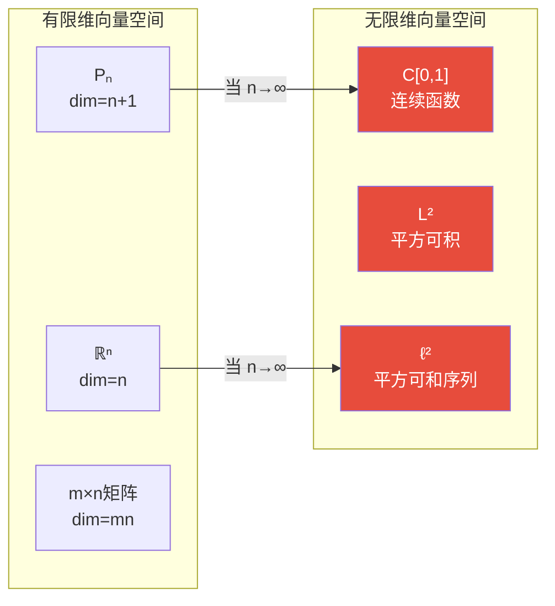
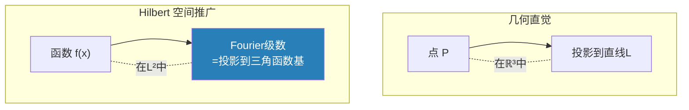

# 第2章 空间

> 从教室里的三维直觉出发，逐步抽象到无限维量子态空间——"空间"这个概念是数学从具体走向抽象的典范。每一层抽象丢掉一些结构，也获得更广的适用范围。

---

## 2.1 什么是空间？

在数学中，"空间" = **一个集合 + 附加结构**。不同的结构定义了不同的空间类型。


> **图释**：从裸集合出发，每一步添加结构（距离、线性、开集、内积）创造出不同品种的空间。这个层级关系是贯穿全章的地图。


---

## 2.2 欧几里得空间 $\mathbb{R}^n$

### 定义与直觉

这是我们最熟悉的空间——我们生活在其中的三维空间 $\mathbb{R}^3$。

$$
\mathbb{R}^n = \{(x_1, x_2, \ldots, x_n) \mid x_i \in \mathbb{R}\}
$$

**欧几里得结构 = 线性结构 + 内积**：

- **向量加法**：$(x_i) + (y_i) = (x_i + y_i)$
- **标量乘法**：$c \cdot (x_i) = (c x_i)$
- **内积（点积）**：$\langle x, y \rangle = \sum_{i=1}^n x_i y_i$
- **欧氏距离**：$d(x,y) = \sqrt{\sum (x_i - y_i)^2}$
- **欧氏范数**：$\|x\| = \sqrt{\langle x, x \rangle}$

### 为什么欧氏空间是所有空间的原型？

因为它**同时拥有**线性、距离、内积三种结构，而且它们是自然兼容的：

$$
\|x\|^2 = \langle x, x \rangle, \quad d(x,y) = \|x - y\|
$$

下面的所有空间类型都是对 $\mathbb{R}^n$ 的某一方面进行**推广或削弱**。

```python
import numpy as np

# 欧氏空间 R^3 中的基本运算
x = np.array([1, 2, 3])
y = np.array([4, -1, 2])

print(f"向量 x = {x}")
print(f"向量 y = {y}")
print(f"加法 x+y = {x + y}")
print(f"标量乘 3*x = {3 * x}")
print(f"内积 <x,y> = {np.dot(x, y)}")
print(f"范数 ||x|| = {np.linalg.norm(x):.3f}")
print(f"距离 d(x,y) = {np.linalg.norm(x - y):.3f}")

# 柯西-施瓦茨不等式: |<x,y>| <= ||x||·||y||
lhs = abs(np.dot(x, y))
rhs = np.linalg.norm(x) * np.linalg.norm(y)
print(f"\n|<x,y>| = {lhs:.3f} <= ||x||·||y|| = {rhs:.3f} ✓")
```

---

## 2.3 向量空间（线性空间）

### 从坐标中解放出来

$\mathbb{R}^n$ 太具体了——它假设我们有一组坐标 $(x_1,\ldots,x_n)$。但很多数学对象也满足"可加可缩"的性质：

- 多项式：$p(x) + q(x)$、$c \cdot p(x)$
- 连续函数：$f(x) + g(x)$、$c \cdot f(x)$
- 矩阵：$A + B$、$c \cdot A$
- 数列：$(a_n) + (b_n)$、$c \cdot (a_n)$

**向量空间公理**：集合 $V$ 配备运算 $+ : V \times V \to V$ 和 $\cdot : \mathbb{R} \times V \to V$，满足：

| 公理群 | 具体公理 |
|--------|---------|
| **加法交换群** | $u+v=v+u$, $(u+v)+w=u+(v+w)$, 存在 $0$ 和 $-v$ |
| **标量乘法的分配律** | $c(u+v)=cu+cv$, $(c+d)u=cu+du$ |
| **标量乘法的结合律** | $(cd)u = c(du)$ |
| **单位标量** | $1 \cdot u = u$ |

### 核心概念：基与维度

向量空间中最深刻的事实是——所有基的大小都相同，这就是**维度**。

$$
\dim V = \text{任何一组基中的向量个数}
$$

- $\mathbb{R}^n$：标准基 $e_1,\ldots,e_n$，维度 $n$
- 次数 $\leq n$ 的多项式空间 $P_n$：基 $\{1,x,x^2,\ldots,x^n\}$，维度 $n+1$
- 连续函数空间 $C[0,1]$：**无限维！**（没有有限基）

> 有限维 vs 无限维是向量空间的第一个大分岔口。 $\S$13 线性代数专注于有限维，而本章下半部分的泛函分析进入无限维世界。



---

## 2.4 度量空间

### 距离的抽象

**定义**：度量空间是一个集合 $X$ 配上一个距离函数 $d: X \times X \to \mathbb{R}_{\geq 0}$，满足：

1. **正定性**：$d(x,y) \geq 0$，且 $d(x,y) = 0 \iff x = y$
2. **对称性**：$d(x,y) = d(y,x)$
3. **三角不等式**：$d(x,z) \leq d(x,y) + d(y,z)$

### 不只是欧氏距离！

| 空间 | 距离定义 | 用途 |
|------|---------|------|
| $\mathbb{R}^n$ 欧氏 | $d_2(x,y) = \sqrt{\sum (x_i-y_i)^2}$ | 几何、物理 |
| $\mathbb{R}^n$ 曼哈顿 | $d_1(x,y) = \sum \|x_i-y_i\|$ | 城市街区距离 |
| $\mathbb{R}^n$ 切比雪夫 | $d_\infty(x,y) = \max_i \|x_i-y_i\|$ | 最坏情况分析 |
| 离散度量 | $d(x,y) = \begin{cases}0 & x=y \\ 1 & x\neq y\end{cases}$ | 理论构造 |
| Hamming距离 | 不同位置的个数 | 编码理论、DNA比对 |
| 图上的最短路径 | 最少边数 | 网络路由 |

```python
import numpy as np

def showcase_metrics():
    x = np.array([1, 2, 3])
    y = np.array([4, 0, 5])
    
    d2 = np.sqrt(np.sum((x - y)**2))
    d1 = np.sum(np.abs(x - y))
    dinf = np.max(np.abs(x - y))
    
    print(f"点 x={x}, y={y}")
    print(f"欧氏距离 d₂ = {d2:.3f}  (直线)")
    print(f"曼哈顿距离 d₁ = {d1}  (直角折线)")
    print(f"切比雪夫距离 d∞ = {dinf}  (最大坐标差)")
    
    # 单位"圆"在不同距离下的形状
    print("\n各距离下的'单位球'(距原点距离<1的点):")
    print("d₂: 圆形, d₁: 菱形, d∞: 正方形")

showcase_metrics()
```

### 度量空间 → 拓扑空间

任何度量空间自然诱导一个拓扑：以**开球** $B(x,r) = \{y \mid d(x,y) < r\}$ 生成开集。这是 $\S$7 拓扑学的起点——拓扑空间是度量空间的进一步推广，它丢掉了距离数值，只保留"开集"的概念。

---

## 2.5 赋范空间与 Banach 空间

### 向量空间的"长度"

在向量空间上叠加一个**范数** $\|\cdot\|: V \to \mathbb{R}_{\geq 0}$：

1. $\|x\| \geq 0$，且 $\|x\| = 0 \iff x = 0$
2. $\|\alpha x\| = |\alpha| \cdot \|x\|$ （齐次性）
3. $\|x + y\| \leq \|x\| + \|y\|$ （三角不等式）

范数自然地导出距离：$d(x,y) = \|x-y\|$。所以 $(V, \|\cdot\|)$ 构成赋范空间，也自动成为度量空间。

### 完备性：Banach 空间

**Cauchy 列**：$\forall \epsilon > 0, \exists N, \forall m,n > N: \|x_m - x_n\| < \epsilon$

如果空间中每个 Cauchy 列都收敛到空间内的一个点，这个空间就是**完备的**。

> **Banach 空间 = 完备的赋范空间**

| 空间 | 范数 | 完备？ | 身份 |
|------|------|:---:|------|
| $\mathbb{R}^n$ | $\|x\|_2$ | ✅ | Banach空间 |
| $C[0,1]$ | $\|f\|_\infty = \sup\|f(x)\|$ | ✅ | Banach空间 |
| $C[0,1]$ | $\|f\|_1 = \int\|f\|$ | ❌ | 赋范(不完备) |
| $\ell^p$ | $\|x\|_p = (\sum \|x_i\|^p)^{1/p}$ | ✅ | Banach空间 |

> **不完备的例子**：在 $\|f\|_1$ 下，连续函数空间中存在 Cauchy 列收敛到不连续的函数——极限"跑出了空间"。完备化这个空间得到 $L^1[0,1]$（$\S$10 测度与积分）。

---

## 2.6 内积空间与 Hilbert 空间

### 在向量空间中引入"角度"

**内积** $\langle \cdot, \cdot \rangle: V \times V \to \mathbb{R}$（或 $\mathbb{C}$）满足：

1. $\langle x, x \rangle \geq 0$，$\langle x, x \rangle = 0 \iff x = 0$
2. $\langle x, y \rangle = \overline{\langle y, x \rangle}$ （共轭对称）
3. 对第一个变量线性

内积诱导范数：$\|x\| = \sqrt{\langle x, x \rangle}$

> **Hilbert 空间 = 完备的内积空间**

### 为什么 Hilbert 空间如此重要？

因为它有**正交性**——可以定义"垂直"：

$$
x \perp y \iff \langle x, y \rangle = 0
$$

这使我们可以做：
- **正交投影**：找到子空间中最接近某点的元素
- **正交基**：用一组相互垂直的基向量表示空间中任何元素
- **Fourier 级数**：$\{e^{inx}\}_{n=-\infty}^\infty$ 是 $L^2[-\pi,\pi]$ 中的一组正交基



### 四大经典 Hilbert 空间

| 空间 | 内积 | 完备基 | 应用 |
|------|------|--------|------|
| $\mathbb{R}^n$ | $\langle x,y \rangle = \sum x_i y_i$ | 标准基 $e_i$ | 几何 |
| $\ell^2$ | $\langle x,y \rangle = \sum x_i \overline{y_i}$ | $e_i = (0,\ldots,1,\ldots)$ | 离散信号 |
| $L^2[a,b]$ | $\langle f,g \rangle = \int f \overline{g}$ | 三角函数族 | 连续信号 |
| $\mathbb{C}^n$ | $\langle x,y \rangle = \sum x_i \overline{y_i}$ | 标准基 | 量子态 |

```python
import numpy as np

# Hilbert 空间中的正交投影演示
# 在 R^3 中，将点投影到平面 z=0

v = np.array([3, 4, 5])
# 平面 z=0 的标准正交基
e1 = np.array([1, 0, 0])
e2 = np.array([0, 1, 0])

# 正交投影: proj = <v,e1>e1 + <v,e2>e2
proj = np.dot(v, e1) * e1 + np.dot(v, e2) * e2

print(f"原向量 v = {v}")
print(f"投影到 xy 平面 = {proj}")
print(f"投影长度 ||proj|| = {np.linalg.norm(proj):.3f}")
print(f"残差 v-proj = {v - proj} (垂直于平面)")

# Fourier 级数: 用三角函数基近似函数
def fourier_approx(x, n_terms):
    """用前 n_terms 项 Fourier 级数近似方波"""
    result = np.zeros_like(x)
    for k in range(n_terms):
        n = 2*k + 1  # 奇数项
        result += (4 / (np.pi * n)) * np.sin(n * x)
    return result

x = np.linspace(0, 2*np.pi, 1000)
for n in [1, 3, 10]:
    approx = fourier_approx(x, n)
    error = np.max(np.abs(approx))
    print(f"Fourier {n}项近似: 最大振幅 = {error:.3f}")
```

---

## 2.7 空间的谱系——一张全景表

| 空间类型 | 附加结构 | 关键概念 | 完备版本 | 应用领域 |
|---------|---------|---------|---------|---------|
| 集合 | 无 | 元素 | — | — |
| 拓扑空间 | 开集 | 连续性、紧致性 | — | $\S$7 拓扑学 |
| 度量空间 | 距离 | Cauchy列、收敛 | 完备度量空间 | 分析、聚类 |
| 向量空间 | 线性运算 | 基、维度、线性变换 | — | $\S$13 线性代数 |
| 赋范空间 | 范数 | 长度、有界性 | **Banach空间** | 泛函分析 |
| 内积空间 | 内积 | 角度、正交性 | **Hilbert空间** | 量子力学 |
| 欧氏空间 | 全部以上 | — | $\mathbb{R}^n$ | 几何、物理 |

> **记忆钩子**：欧氏空间是"满配"——什么结构都有。往其他方向推广时，我们每次只去掉一种结构，研究"还剩下什么"。

---

## 2.8 本章关键点汇总

| # | 关键概念 | 直觉 | 连接章节 |
|---|---------|------|---------|
| 1 | **空间 = 集合 + 结构** | 不同的结构→不同的"空间感" | 全书线索 |
| 2 | **向量空间公理** | 可加可缩 = 线性世界 | $\S$13 线性代数 |
| 3 | **基与维度** | 有限 vs 无限是第一个大分岔 | $\S$9, $\S$13 |
| 4 | **距离公理** | 三角不等式是最关键的一条 | $\S$7 拓扑 |
| 5 | **完备性** | Cauchy列有极限→没有"洞" | $\S$3, $\S$9, $\S$10 |
| 6 | **Banach空间** | = 完备赋范空间 | $\S$9 泛函分析 |
| 7 | **Hilbert空间** | = 完备内积空间，有正交性 | $\S$9, 量子力学 |
| 8 | **Fourier级数 = 投影** | 三角函数基上的正交投影 | $\S$5 函数与映射 |

> 💡 **核心哲学**：数学中的"空间"是一个**渐进抽象**的谱系。每一层抽象都在"失去具体"和"获得普适"之间做交易——拓扑空间没有距离，但能描述任何连续性概念；Hilbert空间失去了有限维的具体性，但能统一描述从量子态到声波的一切。
