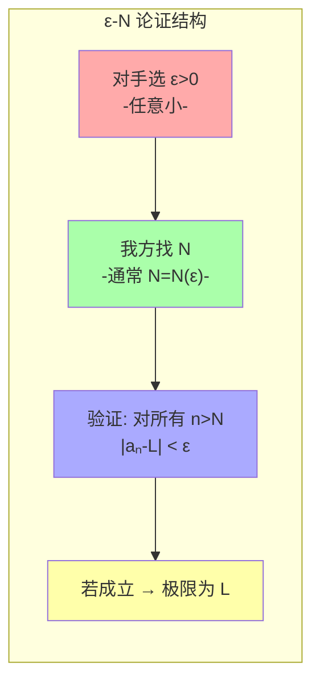
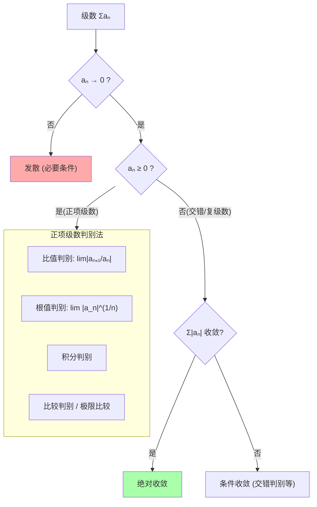
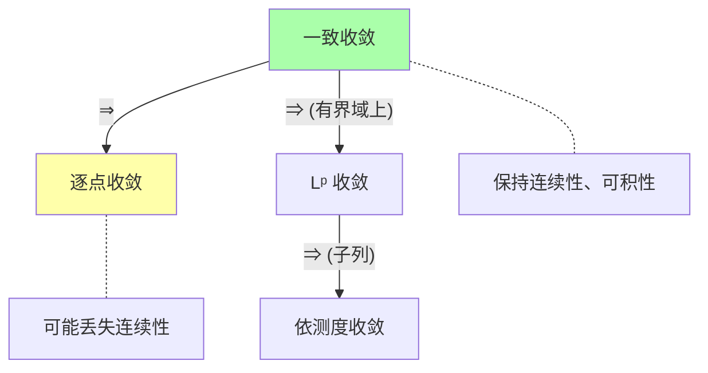

# 第3章 数列与极限

> "无穷"曾经是数学的禁区。极限概念的严格化（19世纪的 $\epsilon$-$\delta$ 革命）是数学史上从直觉到精确的最大飞跃。本章既是微积分的基石，也是分析学的方法论核心。

---

## 3.1 数列：离散变化的数学描述

### 定义与直观

**数列** = 定义在自然数上的函数：$a: \mathbb{N} \to \mathbb{R}$（或 $\mathbb{C}$），记作 $(a_n)_{n=1}^\infty$。

$$
a_1, a_2, a_3, \ldots, a_n, \ldots
$$

数列是**离散动力系统**的最简形式——它描述了一个量在离散时间步骤上的演化。

| 类型 | 定义 | 例子 |
|------|------|------|
| 等差数列 | $a_{n+1} = a_n + d$ | $1, 3, 5, 7, \ldots$ |
| 等比数列 | $a_{n+1} = a_n \cdot q$ | $1, 2, 4, 8, \ldots$ |
| 递推数列 | $a_{n+1} = f(a_n)$ 或 $a_{n+2} = f(a_n, a_{n+1})$ | Fibonacci: $a_{n+2}=a_{n+1}+a_n$ |
| Cauchy列 | $\forall \epsilon>0, \exists N, \forall m,n>N: \lvert a_m-a_n\rvert<\epsilon$ | $a_n = 1/n$ |

---

## 3.2 极限：$\epsilon$-$N$ 定义

### 为什么需要严格定义？

18世纪的数学家说"$a_n$ 无限接近 $L$"就够了。但"无限接近"是什么意思？这导致了大量混乱和错误。19世纪，Cauchy、Weierstrass 等人用逻辑量词给出了精确的刻画。

> **定义**（数列极限）：$\lim_{n \to \infty} a_n = L$ 当且仅当：
>
> $$\forall \epsilon > 0, \; \exists N \in \mathbb{N}, \; \forall n > N: |a_n - L| < \epsilon$$

**逐词翻译**："无论你要求多小的误差 $\epsilon$，我都能找到一个位置 $N$，使得第 $N$ 项之后的所有项与 $L$ 的偏差都不超过 $\epsilon$。"



**图释**：$\epsilon$-$N$ 论证像一个"挑战游戏"。对手出 $\epsilon$（想要多小就多小），我们出 $N$——如果能永远赢下去，极限就成立了。


```python
import math

def verify_limit(a_n, L, epsilon, N_func):
    """验证数列极限: 给定 epsilon，检查 N 是否足够"""
    N = N_func(epsilon)
    max_error = 0
    for n in range(N+1, N+100):
        error = abs(a_n(n) - L)
        max_error = max(max_error, error)
    return max_error < epsilon, N, max_error

# 例1: a_n = 1/n → 0
a_n = lambda n: 1.0 / n
N_func = lambda eps: int(math.ceil(1.0 / eps))

for eps in [0.1, 0.01, 0.001]:
    ok, N, err = verify_limit(a_n, 0, eps, N_func)
    print(f"ε={eps}: N={N}, 最大误差={err:.6f}, {'✓' if ok else '✗'}")
```

### 经典极限公式

| 数列 | 极限 | 关键 |
|------|------|------|
| $\frac{1}{n}$ | $0$ | $N = \lceil 1/\epsilon \rceil$ |
| $\frac{1}{n^p}$ ($p>0$) | $0$ | 任意多项式倒数→0 |
| $q^n$ ($\lvert q\rvert<1$) | $0$ | 几何衰减 |
| $\sqrt[n]{n}$ | $1$ | 慢收敛 |
| $(1 + \frac{1}{n})^n$ | $e$ | $\S$11 常数 |
| $\frac{\sin n}{n}$ | $0$ | 夹逼定理 |

---

## 3.3 级数：无穷和的可能性

### 定义

**级数** = 数列的"累加"：$\sum_{n=1}^\infty a_n = \lim_{N \to \infty} \sum_{n=1}^N a_n$

关键事实：**级数的收敛性取决于部分和数列的极限**。

### 收敛判别法速查



### 关键级数速查表

| 级数 | 收敛条件 | 和（若收敛） |
|------|---------|------------|
| 几何级数 $\sum ar^{n-1}$ | $\lvert r\rvert < 1$ | $\frac{a}{1-r}$ |
| $p$-级数 $\sum \frac{1}{n^p}$ | $p > 1$ | $\zeta(p)$ |
| 调和级数 $\sum \frac{1}{n}$ | **发散** | ∞（$\sim \ln n + \gamma$） |
| 交错调和 $\sum \frac{(-1)^{n-1}}{n}$ | 条件收敛 | $\ln 2$ |
| $\sum \frac{1}{n!}$ | 收敛 | $e$ |

```python
import math

def test_series_convergence(a_n, N=100000):
    """数值检验级数收敛性"""
    partial = 0
    for n in range(1, N+1):
        partial += a_n(n)
    return partial

# 调和级数 -> 发散 (但很慢!)
print("调和级数 Σ1/n:")
for N in [10, 100, 1000, 10000]:
    s = test_series_convergence(lambda n: 1/n, N)
    print(f"  N={N}: S={s:.4f}, S-ln(N)≈{s-math.log(N):.4f} (→ γ≈0.5772)")

# p=2 级数 -> π²/6
s = test_series_convergence(lambda n: 1/(n*n), 100000)
print(f"\nΣ1/n²: S≈{s:.6f} (理论值 π²/6≈{math.pi**2/6:.6f})")

# 几何级数 1/2ⁿ
s = test_series_convergence(lambda n: 0.5**n, 50)
print(f"Σ(1/2)ⁿ: S≈{s:.10f} (理论值 1)")
```

---

## 3.4 Taylor 级数：用多项式逼近一切

### 核心思想

如果函数足够光滑，就可以用它在某点的各阶导数构造一个幂级数，该级数在收敛半径内等于原函数：

$$
f(x) = \sum_{n=0}^\infty \frac{f^{(n)}(a)}{n!}(x-a)^n
$$

**Maclaurin 级数**（$a=0$ 的特例）：

$$
f(x) = f(0) + f'(0)x + \frac{f''(0)}{2!}x^2 + \frac{f'''(0)}{3!}x^3 + \cdots
$$

### 五个最重要的 Taylor 展开

| 函数 | Maclaurin 级数 | 收敛半径 |
|------|---------------|:---:|
| $e^x$ | $\sum_{n=0}^\infty \frac{x^n}{n!}$ | $\infty$ |
| $\sin x$ | $\sum_{n=0}^\infty (-1)^n \frac{x^{2n+1}}{(2n+1)!}$ | $\infty$ |
| $\cos x$ | $\sum_{n=0}^\infty (-1)^n \frac{x^{2n}}{(2n)!}$ | $\infty$ |
| $\frac{1}{1-x}$ | $\sum_{n=0}^\infty x^n$ | $1$ |
| $\ln(1+x)$ | $\sum_{n=1}^\infty (-1)^{n+1}\frac{x^n}{n}$ | $1$ |

> **注意**：欧拉公式 $e^{i\theta} = \cos\theta + i\sin\theta$ 可以从 $e^x$、$\sin x$、$\cos x$ 各自的 Taylor 展开直接推出——将 $x=i\theta$ 代入 $e^x$ 展开，分离实部和虚部即可。这正是 $\S$1 和 $\S$11 中 $e, i, \pi$ 深层关系的代数根源。

```python
import math

def taylor_approx(f_derivs_at_0, x, n_terms):
    """用前 n_terms 项 Taylor 级数近似 f(x)"""
    result = 0
    for n in range(n_terms):
        result += f_derivs_at_0[n] * x**n / math.factorial(n)
    return result

# e^x 的导数都是 1
e_x_derivs = [1] * 20  # f^(n)(0) = 1 for all n

# sin(x) 的导数循环: sin(0)=0, cos(0)=1, -sin(0)=0, -cos(0)=-1
sin_derivs = [0, 1, 0, -1] * 5

x = 1.0
print(f"e^{x} 的 Taylor 近似:")
for n in [1, 3, 5, 10]:
    approx = taylor_approx(e_x_derivs, x, n)
    print(f"  {n}项: {approx:.10f} (精确值: {math.exp(x):.10f}, 误差: {abs(approx-math.exp(x)):.2e})")

x = math.pi/4
print(f"\nsin({x:.4f}) 的 Taylor 近似:")
for n in [1, 3, 5, 10]:
    approx = taylor_approx(sin_derivs, x, n)
    print(f"  {n}项: {approx:.10f} (精确值: {math.sin(x):.10f})")
```

### 余项定理：Lagrange 余项

Taylor 级数截断到 $n$ 项的误差由 Lagrange 余项给出：

$$
R_n(x) = \frac{f^{(n+1)}(\xi)}{(n+1)!}(x-a)^{n+1}, \quad \xi \text{ 在 } a \text{ 和 } x \text{ 之间}
$$

这让我们可以在数值计算中**控制精度**——给定所需精度，反推需要多少项。

---

## 3.5 收敛性：不仅仅是"有极限"

### 收敛的四种强度

| 类型 | 定义 | 重要性 |
|------|------|--------|
| **逐点收敛** | 对每个 $x$，$f_n(x) \to f(x)$ | 最弱，可能丢失连续性 |
| **一致收敛** | $\sup_x \|f_n(x)-f(x)\| \to 0$ | 保持连续性 |
| **$L^p$ 收敛** | $\int \|f_n-f\|^p \to 0$ | 平均收敛（$\S$10） |
| **依测度收敛** | $\mu(\{\|f_n-f\|>\epsilon\}) \to 0$ | 概率论（$\S$10, $\S$14） |



> **关键洞见**：一致收敛才是"好的"收敛——它保证极限函数继承逼近函数序列的优良性质（连续、可导、可积）。这就是为什么在 $\S$9 泛函分析中要研究**算子的一致收敛**，而不仅仅是逐点收敛。

---

## 3.6 本章关键点汇总

| # | 关键概念 | 直觉 | 连接章节 |
|---|---------|------|---------|
| 1 | **$\epsilon$-$N$ 定义** | 逻辑量词精确刻画"无限接近" | $\S$12 微积分 |
| 2 | **Cauchy列** | 内部稳定的数列，在没有"外部极限"时也能判断 | $\S$2 完备性 |
| 3 | **级数 = 无穷和** | 部分和序列的极限 | $\S$11 常数 |
| 4 | **几何级数与 $p$-级数** | 收敛判别法的两个基准 | 全书 |
| 5 | **Taylor级数** | 用多项式无限逼近光滑函数 | $\S$5, $\S$12 |
| 6 | **Lagrange余项** | 精确控制近似误差 | 数值分析 |
| 7 | **一致收敛 vs 逐点收敛** | 好的收敛保持好的性质 | $\S$9 泛函分析 |

> 💡 **核心哲学**：极限不是"到达"，而是"任意逼近"。$\epsilon$-$N$ 和 $\epsilon$-$\delta$ 语言将"无穷"这个哲学概念操作化——你不需要真的"走完无限步"，只需要证明无论多小的误差都可以在有限步内达到。这是现代分析学的精髓。
