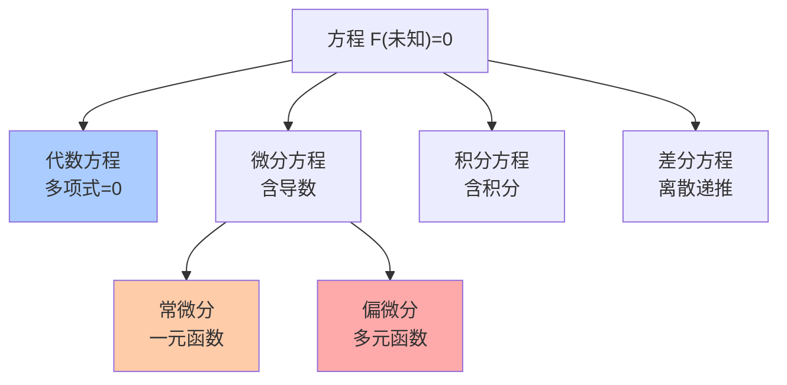
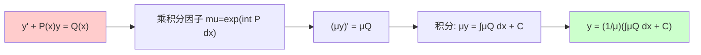
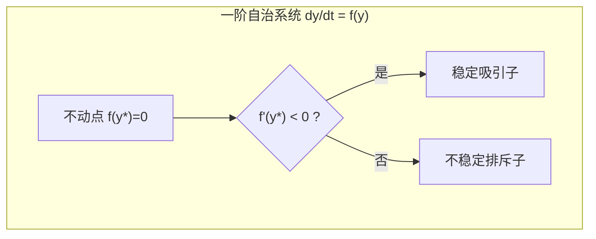
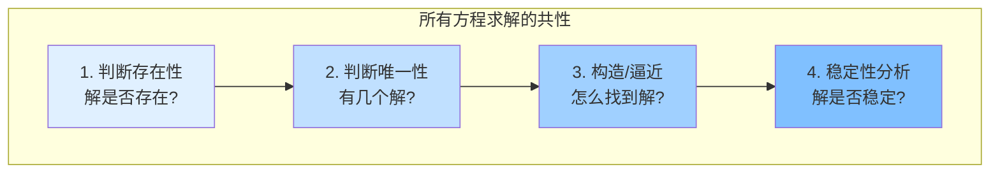

# 第4章 方程

> 方程是数学建模的通用语言——未知量之间的关系被编码为等式，求解过程就是解码。从二次方程到 Navier-Stokes，方程的复杂度在增长，但核心逻辑从未改变：**用已知表达未知**。

---

## 4.1 方程是什么？

**方程** = 包含未知量的等式，它表达了对未知量的**约束**。

$$
F(x, y, \ldots) = 0
$$

求解方程就是找到所有满足约束的未知量取值。方程的"类型"由 $F$ 的形式决定——这定义了数学中最丰富的分类体系之一。



---

## 4.2 代数方程：从二次公式到 Galois 理论

### 一元多项式方程

$$
a_n x^n + a_{n-1} x^{n-1} + \cdots + a_1 x + a_0 = 0
$$

### 可解性随次数的演变

| 次数 | 求解方法 | 可根式解？ |
|:---:|---------|:---:|
| 1 | $x = -b/a$ | ✅ |
| 2 | $x = \frac{-b \pm \sqrt{b^2-4ac}}{2a}$ | ✅ |
| 3 | Cardano 公式（出现复数中间步骤） | ✅ |
| 4 | Ferrari 方法（化归为三次方程） | ✅ |
| $\geq 5$ | — | ❌ **Abel-Ruffini 定理** |

### Galois 理论的直觉

为什么五次及以上不能用根式求解？**Galois 的洞见**：方程的"可解性"取决于其根的**对称群**（Galois 群）的结构。

- 二次方程：根的对称群是 $S_2$，可解
- 三次方程：$S_3$，可解（有合成列）
- 四次方程：$S_4$，可解
- 五次方程：$S_5$，**非可解群**（$A_5$ 是单群）

> 方程的代数可解性 = Galois 群的**可解性**。这是 $\S$8 群论的历史起源，也是抽象代数最辉煌的应用。

```python
import sympy as sp

# 用 sympy 符号求解各类代数方程
x = sp.Symbol('x')

# 二次方程
eq2 = x**2 - 5*x + 6
sol2 = sp.solve(eq2, x)
print(f"x² - 5x + 6 = 0 → x = {sol2}")

# 三次方程
eq3 = x**3 - 6*x**2 + 11*x - 6
sol3 = sp.solve(eq3, x)
print(f"x³ - 6x² + 11x - 6 = 0 → x = {sol3}")

# 五次方程 (一般不能根式解，但特殊形式可解)
eq5 = x**5 - x - 1  # Bring 根式
try:
    sol5 = sp.nroots(eq5)  # 数值解
    print(f"x⁵ - x - 1 = 0 → 数值根: {sol5}")
except Exception as e:
    print(f"Error: {e}")
```

---

## 4.3 常微分方程 (ODE)

### 定义

包含未知函数**一个自变量**的导数的方程：

$$
F(x, y, y', y'', \ldots, y^{(n)}) = 0
$$

### ODE 分类与解法

| 类型 | 标准形式 | 解法 |
|------|---------|------|
| 可分离 | $\frac{dy}{dx} = g(x)h(y)$ | 分离变量积分 |
| 一阶线性 | $y' + P(x)y = Q(x)$ | 积分因子 $e^{\int P dx}$ |
| 恰当方程 | $M dx + N dy = 0$ | 找势函数 |
| 二阶常系数 | $ay'' + by' + cy = 0$ | 特征方程 $ar^2+br+c=0$ |
| 非齐次 | $ay'' + by' + cy = f(x)$ | 特解 + 通解 |

### 解法示例：一阶线性 ODE

对于 $y' + P(x)y = Q(x)$，**积分因子法**：

$$
\mu(x) = e^{\int P(x)dx}
$$

两边乘以 $\mu(x)$，左边变成 $(\mu y)'$，直接积分求解：

$$
y = \frac{1}{\mu(x)} \left(\int \mu(x)Q(x)dx + C\right)
$$



```python
import sympy as sp

x = sp.Symbol('x')
y = sp.Function('y')

# 解 ODE: y' + 2xy = x
ode = sp.Eq(sp.Derivative(y(x), x) + 2*x*y(x), x)
sol = sp.dsolve(ode, y(x))
print(f"y' + 2xy = x")
print(f"通解: {sol}")

# 解 ODE: y'' + y = 0 (简谐振动)
ode2 = sp.Eq(sp.Derivative(y(x), x, 2) + y(x), 0)
sol2 = sp.dsolve(ode2, y(x))
print(f"\ny'' + y = 0")
print(f"通解: {sol2}")
```

### 定性理论：相图与稳定性

当无法求解解析式时，定性分析告诉我们解的"行为"：



---

## 4.4 偏微分方程 (PDE)

### 定义

包含未知函数**多个自变量**的偏导数：

$$
F(x_1,\ldots,x_n, u, \frac{\partial u}{\partial x_1}, \ldots, \frac{\partial^2 u}{\partial x_i \partial x_j}, \ldots) = 0
$$

### 三大经典 PDE 类型


| 类型 | 原型方程 | 物理含义 | 数学特征 |
|------|---------|---------|---------|
| **椭圆型** | $\nabla^2 u = f$ (Poisson) | 稳态、平衡 | 边值问题 |
| **抛物型** | $\frac{\partial u}{\partial t} = \alpha \nabla^2 u$ (热传导) | 扩散、耗散 | 初值问题 |
| **双曲型** | $\frac{\partial^2 u}{\partial t^2} = c^2 \nabla^2 u$ (波动) | 传播、守恒 | 初值问题 |

### 判别式：二阶线性 PDE 的分类

对于 $au_{xx} + 2bu_{xy} + cu_{yy} + \cdots = 0$：

$$
\Delta = b^2 - ac \begin{cases}
< 0 & \text{椭圆型} \\
= 0 & \text{抛物型} \\
> 0 & \text{双曲型}
\end{cases}
$$

> 这和二次曲线 $ax^2+2bxy+cy^2=1$ 的分类完全一致——不是巧合！PDE 的最高阶项决定了方程的"局部形状"，正如二次项决定了二次曲线的类型。

```python
import numpy as np

def pde_classify(a, b, c):
    """二阶线性 PDE 的分类"""
    disc = b**2 - a*c
    if disc < 0:
        return "椭圆型 (如 Poisson 方程)"
    elif disc == 0:
        return "抛物型 (如 热传导方程)"
    else:
        return "双曲型 (如 波动方程)"

print(pde_classify(1, 0, 1))   # u_xx + u_yy: 椭圆
print(pde_classify(1, 0, -1))  # u_xx - u_yy: 双曲
print(pde_classify(1, 0, 0))   # u_xx: 抛物
```

---

## 4.5 差分方程：离散世界的动力学

### 定义

未知量在**离散时间点**上的递推关系：

$$
x_{n+1} = f(x_n, x_{n-1}, \ldots, n)
$$

差分方程之于离散系统，犹如微分方程之于连续系统。

### Logistic 映射——从确定到混沌

$$
x_{n+1} = r x_n (1 - x_n)
$$

这个简单的二次递推当 $r$ 变化时展示了惊人的行为：收敛 → 周期加倍 → 混沌。

```python
def logistic_map(r, x0, n_iter=100):
    """Logistic 映射迭代"""
    xs = [x0]
    for _ in range(n_iter):
        xs.append(r * xs[-1] * (1 - xs[-1]))
    return xs

print("Logistic 映射的不同行为:")
for r, label in [(2.0, "收敛"), (3.2, "周期2"), (3.5, "周期4"), (3.9, "混沌")]:
    xs = logistic_map(r, 0.5, 200)
    # 看最后20个值的分布
    unique_last = len(set(round(x, 4) for x in xs[-50:]))
    print(f"  r={r}: 最后50步有 {unique_last} 个不同值 → {label}")
```

---

## 4.6 方程求解的统一视角



| 方程类型 | 存在性工具 | 唯一性工具 | 求解方法 |
|---------|-----------|-----------|---------|
| 代数 | 代数基本定理 | 因式分解 | Galois理论/数值 |
| ODE | Picard-Lindelöf | Lipschitz条件 | 积分因子/级数 |
| PDE | Lax-Milgram | 极大值原理 | 分离变量/Green函数 |
| 差分 | 不动点定理 | 压缩映射 | 迭代/特征值 |

---

## 4.7 本章关键点汇总

| # | 关键概念 | 直觉 | 连接章节 |
|---|---------|------|---------|
| 1 | **Abel-Ruffini定理** | 五次及以上无求根公式 | $\S$8 群论 |
| 2 | **Galois理论** | 可解性 = Galois群的可解性 | $\S$8 群环域 |
| 3 | **积分因子法** | 把ODE左边变成乘积的导数 | $\S$12 微积分 |
| 4 | **PDE三分法** | 椭圆/抛物/双曲 = 二次型分类 | $\S$6 几何 |
| 5 | **不动点** | 平衡态——$f(x)=x$ 的解 | $\S$9 泛函分析 |
| 6 | **Logistic映射** | 简单递推产生复杂行为 | $\S$20 复杂性 |

> 💡 **核心哲学**：方程 = 约束。求解的本质是从"满足条件的所有可能性"中找出答案。存在性、唯一性、稳定性构成了数学建模的三角框架——先确认问题有意义（存在解），再确认答案确定（唯一），最后确认微小变化不会颠覆结论（稳定）。
