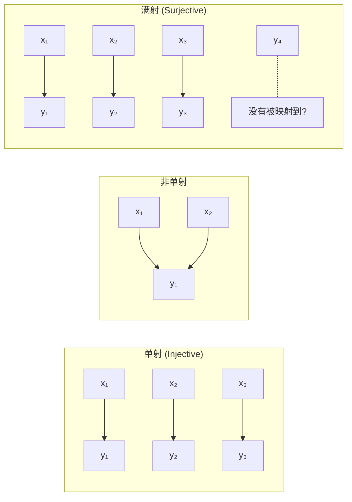
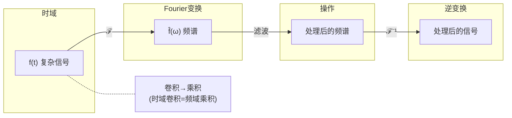
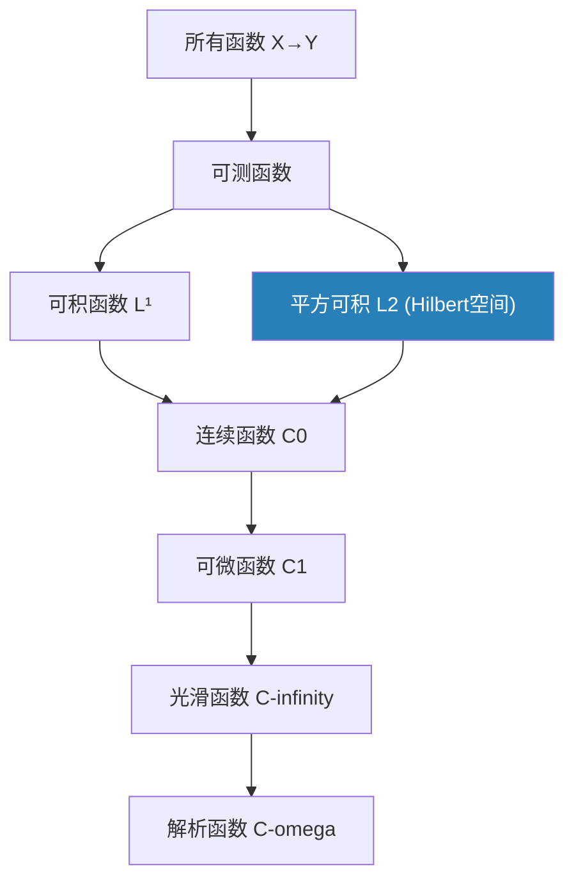

# 第5章 函数与映射

> 函数是数学中最重要的抽象——输入与输出之间的确定关系。从中学课本的 $y=f(x)$ 到现代数学的函子 (functor)，"映射"的概念在每一次泛化中获得更强大的表达能力。

---

## 5.1 函数的现代定义

**函数** $f: X \to Y$ = 对 $X$ 中每个元素唯一指定 $Y$ 中一个元素。

$$
\forall x \in X, \exists! y \in Y: f(x) = y
$$

> 关键转变：函数不是"公式"，而是**对应关系**。"不可用初等函数表达"的函数远远多于"有公式"的函数。

### 三种基本性质

| 性质 | 定义 | 直观 |
|------|------|------|
| **单射** | $f(x_1)=f(x_2) \Rightarrow x_1=x_2$ | 不同输入→不同输出 |
| **满射** | $\forall y \in Y, \exists x: f(x)=y$ | 覆盖整个目标域 |
| **双射** | 既单又满 | 一一对应，可逆 |



---

## 5.2 映射：保持结构的函数

当 $X$ 和 $Y$ 有额外的数学结构时，"好的"映射应该**保持**这些结构。

| 结构 | 保持结构的映射 | 条件 |
|------|-------------|------|
| 序 | 单调函数 | $x \leq y \Rightarrow f(x) \leq f(y)$ |
| 代数运算 | 同态 | $f(x \cdot y) = f(x) \cdot f(y)$ |
| 线性 | 线性映射 | $f(ax+by) = a f(x) + b f(y)$ |
| 拓扑 | 连续映射 | 开集的原像是开集 |
| 距离 | 等距映射 | $d(f(x), f(y)) = d(x,y)$ |
| 光滑结构 | 微分同胚 | 可微且逆也可微 |

> **核心洞见**：学习数学就是学习"什么映射保持了什么样的结构"。这在 $\S$18 范畴论中将获得终极统一——范畴 = 对象 + 保持结构的态射。

---

## 5.3 变换：改变表示形式

### 积分变换的通用哲学

**变换** = 把函数从"时域/空域"变到"频域/特征域"，使得原来困难的操作变得简单。

| 变换 | 公式 | 核心作用 |
|------|------|---------|
| **Fourier** | $\hat{f}(\omega) = \int f(t)e^{-i\omega t}dt$ | 频率分解 |
| **Laplace** | $F(s) = \int_0^\infty f(t)e^{-st}dt$ | ODE→代数方程 |
| **Z变换** | $F(z) = \sum f[n]z^{-n}$ | 离散信号 |
| **小波** | 多尺度分析 | 局部时频分析 |

### 为什么 Fourier 变换如此重要？

它把一个函数（信号）分解为不同频率的正弦波叠加：

$$
f(t) = \frac{1}{2\pi} \int_{-\infty}^\infty \hat{f}(\omega) e^{i\omega t} d\omega
$$



```python
import numpy as np

# Fourier 变换演示：从叠加的正弦波中提取频率成分
t = np.linspace(0, 1, 500, endpoint=False)
# 信号: 50Hz + 120Hz 叠加
signal = np.sin(2*np.pi*50*t) + 0.5*np.sin(2*np.pi*120*t)

# FFT
fft = np.fft.fft(signal)
freqs = np.fft.fftfreq(len(t), t[1]-t[0])

# 找到主要频率
magnitude = np.abs(fft)
peak_indices = np.argsort(magnitude)[-4:]  # 取前4个峰值
print("主要频率成分:")
for idx in peak_indices:
    if freqs[idx] >= 0 and magnitude[idx] > 1:
        print(f"  频率: {freqs[idx]:.1f} Hz, 振幅: {magnitude[idx]/len(t):.3f}")
```

---

## 5.4 算子：以函数为输入的函数

### 定义

**算子** $T: V \to W$ 是两个**函数空间**之间的映射。

这在 $\S$9 泛函分析中是核心概念。最重要的两类：

| 算子类型 | 形式 | 例子 |
|---------|------|------|
| 微分算子 | $Tf = f'$ | $\frac{d}{dx}: C^1 \to C$ |
| 积分算子 | $(Tf)(x) = \int K(x,y)f(y)dy$ | Fredholm 算子 |
| 乘法算子 | $(Tf)(x) = \phi(x)f(x)$ | 量子力学中的位置算子 |
| 投影算子 | $P^2 = P$ | 正交投影到子空间 |

### 有界性与连续性

在线性算子中，**有界性 = 连续性**：

$$
\|T\| = \sup_{\|f\|=1} \|Tf\| < \infty \iff T \text{ 连续}
$$

> 微分算子 $\frac{d}{dx}$ 是**无界**的——这就是为什么微分方程比代数方程难得多。无界算子的谱理论是量子力学的数学基础（$\S$9）。

---

## 5.5 函数空间的层级



### 函数"好"的程度

| 正则性层级 | 记号 | 含义 | 例子 |
|-----------|------|------|------|
| 可测 | — | "能被积分" | Dirichlet函数 |
| 可积 | $L^1$ | $\int \|f\| < \infty$ | $f(x)=1/\sqrt{x}$ 在 $(0,1)$ |
| 平方可积 | $L^2$ | $\int \|f\|^2 < \infty$ | "有限能量"信号 |
| 连续 | $C^0$ | 无跳跃 | $\|x\|$ |
| 可微 | $C^1$ | 有连续导函数 | 光滑无尖角 |
| 光滑 | $C^\infty$ | 任意阶可导 | $e^{-1/x^2}$ |
| 解析 | $C^\omega$ | 等于其Taylor级数 | $e^x, \sin x$ |

---

## 5.6 本章关键点汇总

| # | 关键概念 | 直觉 | 连接章节 |
|---|---------|------|---------|
| 1 | **函数 = 对应关系** | 不是"公式" | $\S$18 范畴论 |
| 2 | **同态 = 保持结构的映射** | 结构→保持结构的映射 | $\S$8 代数 |
| 3 | **Fourier 变换** | 时域→频域，卷积→乘积 | $\S$9, $\S$14 |
| 4 | **卷积定理** | $\mathcal{F}(f*g) = \mathcal{F}(f) \cdot \mathcal{F}(g)$ | $\S$12 |
| 5 | **算子 = 函数的函数** | 无限维的"矩阵" | $\S$9 泛函分析 |
| 6 | **正则性层级** | $L^1 \supset L^2 \supset C^0 \supset C^1 \supset C^\infty \supset C^\omega$ | $\S$10 测度 |

> 💡 **核心哲学**：函数概念的三级跳——(1) 从"公式"到"对应关系"；(2) 从"函数"到"映射"（保持结构）；(3) 从"函数的函数"到"算子"（无限维线性代数）。每一步都极大地拓展了数学的疆域。
