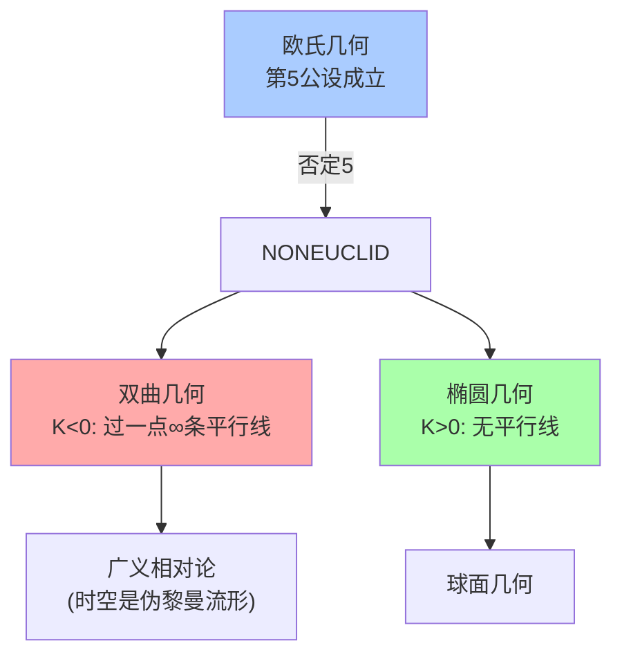
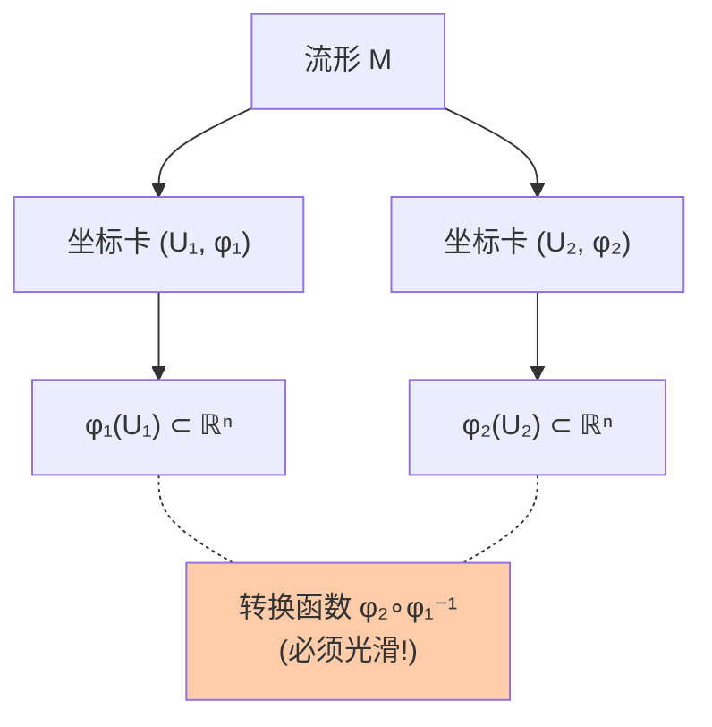

# 第6章 几何

> 从欧几里得的五大公设到现代微分流形，几何学经历了三次革命性的扩张：非欧几何打破了"空间唯一"的教条，解析几何将图形翻译为方程，微分几何将微积分引入弯曲空间。

---

## 6.1 欧氏几何：公理体系的典范

### 五大公设

欧几里得《几何原本》（约公元前300年）从23个定义和5条公设出发，推导出465个命题：

1. 过任意两点可作一直线
2. 线段可任意延长
3. 以任意点为心、任意长为半径可作圆
4. 所有直角都相等
5. **平行公设**：若一直线与两直线相交，且同侧内角和小于两直角，则两直线在该侧相交

> 第5公设的不自然性困扰了数学家两千多年。最终发现：**否定它也能构造一致的几何**——这就是非欧几何的起源。

---

## 6.2 非欧几何：弯曲的空间

### 三种常曲率几何

| 几何 | 曲率 | 三角形内角和 | 平行线 |
|------|:---:|:---:|--------|
| **双曲几何** | $K < 0$ | $< 180^\circ$ | 过线外一点有无穷多条 |
| **欧氏几何** | $K = 0$ | $= 180^\circ$ | 过线外一点恰有一条 |
| **椭圆几何** | $K > 0$ | $> 180^\circ$ | 无平行线 |


### 双曲几何的模型：Poincaré 圆盘

在单位圆盘 $\mathbb{D} = \{|z| < 1\}$ 上，定义双曲距离：

$$
d(z_1, z_2) = \text{arcosh}\left(1 + \frac{2|z_1-z_2|^2}{(1-|z_1|^2)(1-|z_2|^2)}\right)
$$

"直线"（测地线）是垂直于单位圆周的圆弧。M.C. Escher 的圆形镶嵌画就是双曲平面的绝佳可视化。



---

## 6.3 解析几何：坐标系的力量

### Descartes 的发明

将几何对象翻译为代数方程：

- **点**→坐标 $(x,y)$
- **直线**→一次方程 $ax+by+c=0$
- **圆**→二次方程 $(x-h)^2+(y-k)^2=r^2$
- **圆锥曲线**→二次方程 $Ax^2+Bxy+Cy^2+Dx+Ey+F=0$

### 二次型的分类（不变量视角）

对于 $Ax^2 + Bxy + Cy^2$，判别式 $\Delta = B^2 - 4AC$ 决定了曲线的类型：

| $\Delta$ | 类型 | 例子 |
|:---:|------|------|
| $<0$ | 椭圆 | $x^2+4y^2=1$ |
| $=0$ | 抛物线 | $y=x^2$ |
| $>0$ | 双曲线 | $x^2-y^2=1$ |

> 这个分类与 $\S$4 中 PDE 的椭圆/抛物/双曲分类完全一致——因为二阶PDE的分析就依赖于其"特征二次型"的符号。

---

## 6.4 微分几何：弯曲空间上的微积分

### 曲线的 Frenet 标架

对空间曲线 $\gamma(s)$（弧长参数化），定义：

- **切向量** $T = \gamma'$
- **主法向量** $N = T'/\|T'\|$
- **副法向量** $B = T \times N$
- **曲率** $\kappa = \|T'\|$（弯曲程度）
- **挠率** $\tau = -B' \cdot N$（扭转程度）

Frenet-Serret 公式给出了标架沿曲线的变化规律：


$$
\begin{pmatrix} T' \\ N' \\ B' \end{pmatrix} = 
\begin{pmatrix} 0 & \kappa & 0 \\ -\kappa & 0 & \tau \\ 0 & -\tau & 0 \end{pmatrix}
\begin{pmatrix} T \\ N \\ B \end{pmatrix}
$$

这个反对称矩阵揭示了曲率和挠率如何"驱动"标架的旋转。

### 曲面与 Gauss 的绝妙定理 (Theorema Egregium)

曲面的**Gauss 曲率** $K = \kappa_1 \kappa_2$（两个主曲率之积）在**局部等距变换下保持不变**。

> 这意味着——二维生物不需要"看到"第三维，仅通过在曲面内部测量距离和角度，就能推断出曲率！这就是内蕴几何的开端。

### 流形 (Manifold)：现代几何的核心对象

**定义**：$n$ 维光滑流形是一个 Hausdorff 空间，局部同胚于 $\mathbb{R}^n$，且坐标卡之间的转换函数是光滑的。



> 流形是现代物理和几何的统一语言：时空是4维 Lorentz 流形，量子态的投影空间是复射影流形，机器人配置空间是 $SO(3)$ 流形。

```python
import numpy as np

# 曲线的曲率与挠率计算
def compute_frenet(curve_points):
    """数值计算离散曲线的 Frenet 标架和曲率"""
    n = len(curve_points)
    T = np.zeros_like(curve_points)
    N = np.zeros_like(curve_points)
    B = np.zeros_like(curve_points)
    kappa = np.zeros(n)
    tau = np.zeros(n)
    
    for i in range(1, n-1):
        # 切向量 (中心差分)
        T[i] = (curve_points[i+1] - curve_points[i-1])
        T[i] = T[i] / np.linalg.norm(T[i])
    
    for i in range(2, n-2):
        # 曲率
        dT = (T[i+1] - T[i-1]) / 2
        kappa[i] = np.linalg.norm(dT)
        if kappa[i] > 1e-10:
            N[i] = dT / kappa[i]
        # 副法向量
        B[i] = np.cross(T[i], N[i])
        # 挠率
        dB = (B[i+1] - B[i-1]) / 2
        tau[i] = -np.dot(dB, N[i])
    
    return T, N, B, kappa, tau

# 螺旋线: r(t) = (cos t, sin t, t)
t = np.linspace(0, 4*np.pi, 200)
helix = np.column_stack([np.cos(t), np.sin(t), t/4])
T, N, B, kappa, tau = compute_frenet(helix)

print("螺旋线的曲率和挠率:")
print(f"  曲率 κ ≈ {np.mean(kappa[10:-10]):.3f} (理论: 1/(1+(1/4)²) ≈ 0.941)")
print(f"  挠率 τ ≈ {np.mean(tau[10:-10]):.3f} (理论: (1/4)/(1+(1/4)²) ≈ 0.235)")
```

---

## 6.5 代数几何：多项式方程定义的形状

### 基本思想

代数几何研究**多项式方程组的解集**——代数簇 (variety)。

$$
V = \{(x_1,\ldots,x_n) \mid f_1(x)=0, \ldots, f_k(x)=0\}
$$

### 核心对应：代数 ↔ 几何

| 代数概念 | 几何对应 |
|---------|---------|
| 多项式环 $k[x_1,\ldots,x_n]$ | 仿射空间 $\mathbb{A}^n$ |
| 理想 $I$ | 代数簇 $V(I)$ |
| 商环 $k[x]/I$ | 坐标环 = 簇上的"函数" |
| 素理想 | 不可约簇 |
| 极大理想 | 点 |

> **Hilbert 零点定理**：$I(V(J)) = \sqrt{J}$——这建立了代数（理想）和几何（簇）之间的一一对应，是代数几何的基石。

---

## 6.6 本章关键点汇总

| # | 关键概念 | 直觉 | 连接章节 |
|---|---------|------|---------|
| 1 | **平行公设的独立性** | 否定第5公设→非欧几何 | $\S$17 公理系统 |
| 2 | **曲率** | 空间的内在弯曲量 | $\S$7 拓扑 |
| 3 | **Frenet标架** | 曲线的局部"坐标系" | 微分几何基础 |
| 4 | **Gauss绝妙定理** | 曲率是内在的，不需要更高维 | 内蕴几何 |
| 5 | **流形 = 局部像 ℝⁿ** | 弯曲空间的"地图集" | $\S$7 拓扑 |
| 6 | **理想 ↔ 代数簇** | 代数 ↔ 几何的字典 | $\S$8 环论 |

> 💡 **核心哲学**：几何学的演进是从"我们生活在什么空间"到"我们可以构造什么空间"的转变。欧氏几何是观察，非欧几何是发明，解析几何是翻译，微分几何是微积分的几何化，代数几何是代数与几何的深层统一。
