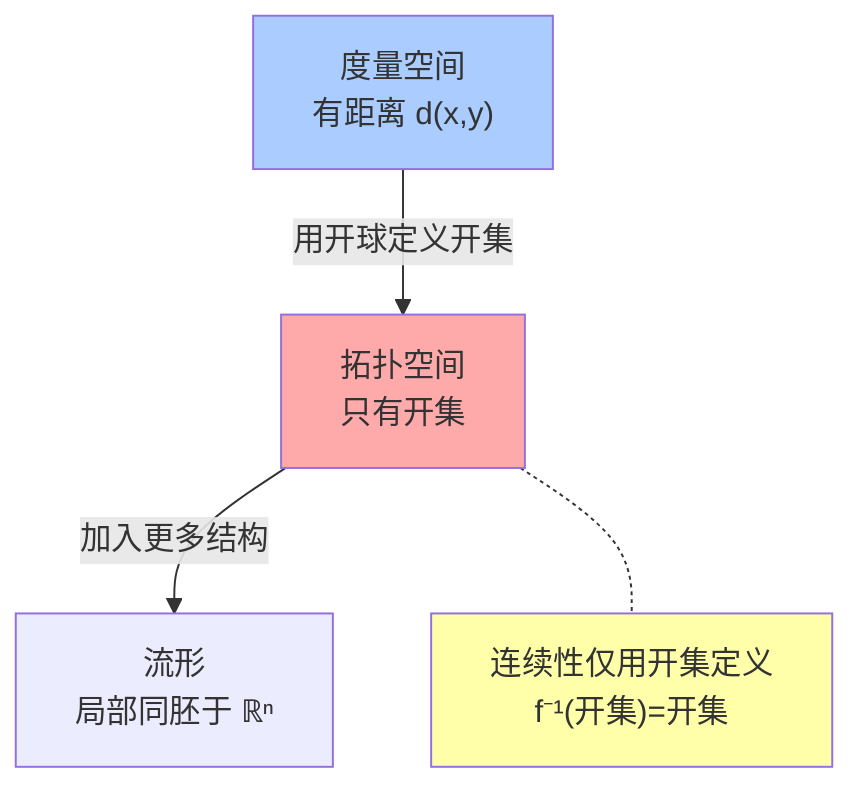
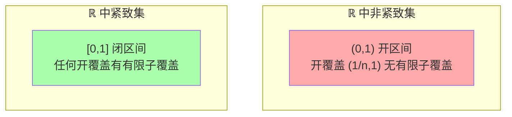

# 第7章 拓扑

> "拓扑学家分不清咖啡杯和甜甜圈"——这句玩笑揭示了拓扑学的本质：它研究在**连续变形**（拉伸、扭曲，但不撕裂、不粘合）下保持不变的性质。从七桥问题到大数据拓扑分析，这门"橡皮几何学"是当代数学的骨架。

---

## 7.1 拓扑空间：用开集定义连续性

### 公理化定义

**拓扑空间** $(X, \tau)$ = 集合 $X$ + 指定哪些子集是"开集"：

1. $\emptyset, X \in \tau$
2. 任意多个开集的**并**仍是开集
3. 有限多个开集的**交**仍是开集

> 不需要距离！只需要知道什么是开集，就能定义连续性：
> $f: X \to Y$ **连续** $\iff$ 对 $Y$ 中每个开集 $U$，$f^{-1}(U)$ 是 $X$ 中的开集。



### 拓扑的"粗细"

| 极端 | 开集 | 性质 |
|------|------|------|
| 平凡拓扑 | 只有 $\{\emptyset, X\}$ | 只有常值映射连续（到Hausdorff空间） |
| 离散拓扑 | 所有子集都是开集 | 所有映射连续 |
| 通常拓扑 (ℝ) | 由开区间生成 | 我们熟悉的连续性 |

---

## 7.2 连通性：空间是否"一整块"

### 定义

$X$ 是**连通的**，如果不能写成两个非空不交开集的并。

### 连通性的层级

| 性质 | 定义 | 例子 |
|------|------|------|
| 连通 | 不能分裂为两个开集 | ℝ, 圆周 |
| 道路连通 | 任意两点有连续路径连接 | ℝⁿ, 球面 |
| 单连通 | 道路连通 + 每条闭合路径可缩为点 | ℝ², 球面(去掉一点) |
| 完全不连通 | 只有单点集是连通子集 | ℚ, Cantor集 |

```python
# 拓扑连通性的可视化：判断图是否连通
from collections import defaultdict

def is_graph_connected(edges, n_vertices):
    """判断图是否连通 (拓扑连通性的离散类比)"""
    adj = defaultdict(list)
    for u, v in edges:
        adj[u].append(v)
        adj[v].append(u)
    
    visited = set()
    def dfs(v):
        visited.add(v)
        for neighbor in adj[v]:
            if neighbor not in visited:
                dfs(neighbor)
    
    dfs(0)
    return len(visited) == n_vertices

# 连通图
connected = [(0,1), (1,2), (2,3), (3,0)]
print("环图连通?", is_graph_connected(connected, 4))

# 不连通图
disconnected = [(0,1), (2,3)]
print("分离图连通?", is_graph_connected(disconnected, 4))
```

---

## 7.3 紧致性：推广"有限封闭有界"

### 为什么需要紧致性？

在 $\mathbb{R}^n$ 中，Heine-Borel 定理说：**紧致 = 有界闭集**。但在无限维空间中，有界闭集不一定是紧致的——紧致性是比"有界闭集"更微妙的性质。

### 定义与等价刻画

$X$ 是**紧致的** $\iff$ 任何开覆盖都有有限子覆盖。

> 在度量空间中：紧致 $\iff$ 列紧（每个序列有收敛子列）$\iff$ 完备且全有界

### 紧致空间的好性质

| 性质 | 说明 |
|------|------|
| 连续函数达到最大/最小值 | $\max_{x\in X} f(x)$ 存在 |
| 闭子集仍紧致 | 紧致空间的"好"子空间 |
| 紧致空间的积仍紧致 | Tychonoff 定理 |
| 紧致 Hausdorff 空间中连续双射即同胚 | "足够好的空间" |



---

## 7.4 同胚与同伦：两种"相同"的层次

### 同胚 (Homeomorphism)

$f: X \to Y$ 是**同胚** $\iff$ $f$ 是连续双射，且 $f^{-1}$ 也连续。

> 同胚是拓扑学中的"等价关系"——两个同胚的空间在拓扑意义下"完全一样"。


### 同伦 (Homotopy)

$f,g: X \to Y$ 是**同伦的** $\iff$ 存在连续映射 $H: X \times [0,1] \to Y$ 使得 $H(x,0)=f(x)$，$H(x,1)=g(x)$。

> 同伦是一种"连续变形"——两个映射可以连续地相互转化。

$$
\text{同胚} \Rightarrow \text{同伦等价}, \quad \text{逆不真}
$$

### 基本群：检测"孔洞"

空间 $X$ 在基点 $x_0$ 处的**基本群** $\pi_1(X, x_0)$ = 以 $x_0$ 为起终点的闭合路径的同伦类，群运算为路径拼接。

| 空间 | 基本群 | 含义 |
|------|--------|------|
| $\mathbb{R}^n$ ($n\geq 2$) | $\{e\}$ 平凡群 | 无孔 |
| 圆周 $S^1$ | $\mathbb{Z}$ | 绕孔次数 |
| 环面 $T^2$ | $\mathbb{Z} \times \mathbb{Z}$ | 两个独立孔 |
| 双环面 | 自由群 $F_2$ | 两个非交换的孔 |

> 基本群是**代数拓扑**的核心工具——用代数（群论）来研究拓扑空间的形状。这在 $\S$8 群论中将看到代数的力量如何投射到几何中。

```python
# 简单同伦的不变量：Euler 示性数
def euler_characteristic(vertices, edges, faces):
    """V - E + F = χ, 拓扑不变量"""
    return vertices - edges + faces

# 所有凸多面体: χ = 2
print("立方体: V=8, E=12, F=6 → χ =", euler_characteristic(8, 12, 6))
print("四面体: V=4, E=6, F=4 → χ =", euler_characteristic(4, 6, 4))
print("环面: V=16, E=32, F=16 → χ =", euler_characteristic(16, 32, 16))
# 球面的 χ=2, 环面的 χ=0 — 拓扑不同!
```

---

## 7.5 本章关键点汇总

| # | 关键概念 | 直觉 | 连接章节 |
|---|---------|------|---------|
| 1 | **拓扑空间公理** | 用开集定义"邻近"，不需要距离 | $\S$2 空间 |
| 2 | **连续性 = 开集的原像是开集** | 拓扑版本的 $\epsilon$-$\delta$ | $\S$12 微积分 |
| 3 | **连通性** | 空间不能裂成两块 | 分析、动力系统 |
| 4 | **紧致性 = 有限覆盖** | 推广"有界闭集"到任意空间 | $\S$2 度量, $\S$9 |
| 5 | **同胚 $\neq$ 同伦** | 同伦允许"压缩"，更粗糙 | 代数拓扑 |
| 6 | **基本群 $\pi_1$** | 用群论检测"孔洞" | $\S$8 群论 |

> 💡 **核心哲学**：拓扑学是从"精确"到"柔性"的转变——我们不再关心具体的大小和形状，只关心在连续变形下不会改变的那些最深层的结构特征。这种"橡皮几何"视角在数据科学（持久同调）、机器人路径规划（构型空间的连通性）、物理（拓扑绝缘体）等领域正变得日益重要。
