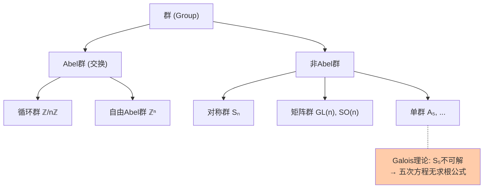
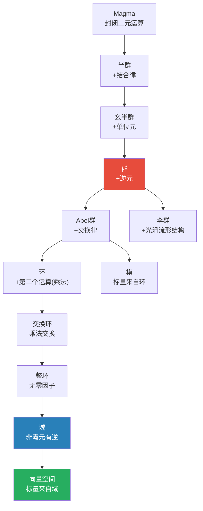

# 第8章 群、环、域等代数结构

> 抽象代数的主线故事：从"数"的运算中提炼出共同模式，然后用这些模式去理解对称性、可解性、几何变换——最终发现代数结构无处不在。群刻画对称，环刻画多项式，域刻画可除性。

---

## 8.1 群：对称性的数学语言

### 定义

**群** $(G, \cdot)$ 是一个集合配上一个二元运算，满足：

1. **封闭性**：$a,b \in G \Rightarrow a \cdot b \in G$
2. **结合律**：$(a \cdot b) \cdot c = a \cdot (b \cdot c)$
3. **单位元**：$\exists e \in G, \forall a: e \cdot a = a \cdot e = a$
4. **逆元**：$\forall a, \exists a^{-1}: a \cdot a^{-1} = a^{-1} \cdot a = e$

若还满足交换律 $a \cdot b = b \cdot a$，则为**Abel 群**。

### 群的关键子结构

| 概念 | 定义 | 意义 |
|------|------|------|
| **子群** $H \leq G$ | 封闭于群运算的子集 | 研究"更小的对称性" |
| **正规子群** $H \trianglelefteq G$ | $gHg^{-1}=H$ | 可构造商群的条件 |
| **商群** $G/H$ | 陪集的群 | "模掉"某个对称性 |
| **同态** $\phi: G \to H$ | $\phi(ab)=\phi(a)\phi(b)$ | 保持群结构 |

### 群的"DNA"——Lagrange 定理与 Sylow 定理

**Lagrange 定理**：子群的阶整除群的阶：$|H| \mid |G|$。

**Sylow 定理**（部分）：若 $|G| = p^k \cdot m$（$p$ 不整除 $m$），则存在阶为 $p^k$ 的子群。

> 这些定理告诉我们——群的阶（元素个数）决定了它的内部结构。正如质因数分解决定整数的结构，Sylow $p$-子群揭示了有限群的"骨架"。

### 群的分类：从具体到抽象

| 群 | 运算 | 含义 |
|----|------|------|
| $\mathbb{Z}$ | + | 整数加法群 |
| $\mathbb{Z}/n\mathbb{Z}$ | + mod n | 循环群 |
| $S_n$ | 置换复合 | 对称群（$n!$ 个元素） |
| $D_n$ | 对称操作 | 二面体群（正 $n$ 边形的对称） |
| $GL(n,\mathbb{R})$ | 矩阵乘法 | 一般线性群 |
| $SO(3)$ | 旋转复合 | 三维旋转群 |
| $A_5$ | 置换复合 | 最小非 Abel 单群 |



### 群作用：群真正"发挥作用"的方式

**群作用** $G \curvearrowright X$ = 群元素作为集合 $X$ 上的**变换**。

> 群不是用来"看着"的——群是用来"做事"的。一个群在每个受它作用的集合上留下轨道（orbits）和稳定子（stabilizers），这构成了**轨道-稳定子定理**：
>
> $$|G| = |\text{Orb}(x)| \cdot |\text{Stab}(x)|$$

```python
from itertools import permutations

# 置换群 S₃ 的 Cayley 表
S3 = list(permutations([1, 2, 3]))
print("S₃ 的 6 个元素:", S3)

# 验证 S₃ 是非 Abel 群
a = (1, 3, 2)  # 置换: 1→1, 2→3, 3→2
b = (2, 1, 3)  # 置换: 1→2, 2→1, 3→3

def compose(p, q):
    """置换的复合: 先p后q"""
    return tuple(p[q[i]-1] for i in range(len(p)))

ab = compose(a, b)
ba = compose(b, a)
print(f"a∘b = {ab}")
print(f"b∘a = {ba}")
print(f"a∘b {'=' if ab==ba else '≠'} b∘a → S₃ 非 Abel")
```

---

## 8.2 环：同时研究加法和乘法

### 定义

**环** $(R, +, \times)$ 满足：
- $(R, +)$ 是 Abel 群
- $\times$ 满足结合律和分配律
- 乘法不一定有逆元，也不一定交换

| 环的类型 | 额外条件 | 例子 |
|---------|---------|------|
| 交换环 | $ab = ba$ | $\mathbb{Z}, \mathbb{Z}[x]$ |
| 整环 | 无零因子 | $\mathbb{Z}, \mathbb{R}[x]$ |
| 除环 | 非零元都有乘法逆 | 四元数 $\mathbb{H}$ |
| **域** | 交换 + 非零元有逆 | $\mathbb{Q}, \mathbb{R}, \mathbb{C}$ |
| 理想 | 吸收乘法 | $(2) \subset \mathbb{Z}$ |

### 理想与商环

**理想** $I \subseteq R$ 是环中一个对加法封闭、对环乘法"吸收"的子集：$r \in R, i \in I \Rightarrow ri \in I$。

> 理想之于环 = 正规子群之于群。有了理想才能做商环 $R/I$。

**素理想** $P$：$ab \in P \Rightarrow a\in P$ 或 $b\in P$  
**极大理想** $M$：$\not\exists$ 理想 $J$ 使得 $M \subsetneq J \subsetneq R$

> 在 $\S$6 代数几何中：极大理想 $\leftrightarrow$ 点，素理想 $\leftrightarrow$ 不可约子簇。

---

## 8.3 域：允许四则运算的系统

### 定义与例子

**域** = 加减乘除（除数非零）全部封闭的代数系统。

$$
\underbrace{\mathbb{Q} \subset \mathbb{R} \subset \mathbb{C}}_{\text{特征 0 的域}}, \quad \underbrace{\mathbb{F}_p = \mathbb{Z}/p\mathbb{Z}}_{\text{特征 p 的有限域}}
$$

### 域扩张：构造更大的域

若 $K \subseteq L$ 都是域，则 $L/K$ 是一个**域扩张**。扩张次数 $[L:K] = \dim_K L$。

| 扩张类型 | 定义 | 例子 |
|---------|------|------|
| 单扩张 | $L = K(\alpha)$ | $\mathbb{Q}(\sqrt{2})$ |
| 代数扩张 | 所有元都是 $K$ 上代数元 | $\mathbb{Q}(\sqrt[3]{2})$ |
| 超越扩张 | 含有超越元 | $\mathbb{Q}(\pi)$ |
| Galois 扩张 | 正规 + 可分 | $\mathbb{Q}(\sqrt{2}, i)$ |

> 域扩张理论是 $\S$4 中 Galois 理论的舞台——方程的 Galois 群就是其分裂域的 Galois 群（保持基域不动的自同构群）。

```python
# 有限域 F₅ 上的运算
def F5_add(a, b): return (a + b) % 5
def F5_mul(a, b): return (a * b) % 5
def F5_inv(a):
    """F₅ 中 a 的乘法逆元: a*b ≡ 1 (mod 5)"""
    for b in range(1, 5):
        if (a * b) % 5 == 1:
            return b
    return None

print("有限域 F₅ 的乘法表:")
for a in range(5):
    row = [F5_mul(a, b) for b in range(5)]
    print(f"  {a} | {' '.join(map(str, row))}")

print("\nF₅ 中的乘法逆元:")
for a in range(1, 5):
    print(f"  {a}⁻¹ = {F5_inv(a)} (验证: {a}*{F5_inv(a)} mod 5 = {F5_mul(a, F5_inv(a))})")
```

---

## 8.4 模、李群、代数

### 模 (Module)：向量空间的推广

向量空间 = 标量来自**域**。模 = 标量来自**环**。

| 结构 | 标量来源 | 是否需要基 |
|------|---------|:---:|
| 向量空间 | 域 | ✅ 总有基 |
| 自由模 | 环 | ✅ 有基 |
| 一般模 | 环 | ❌ 未必有基 |

> $\mathbb{Z}$-模 = Abel 群。这个观察统一了群论和模论。

### 李群 (Lie Group)

**李群** = 同时具有群结构和光滑流形结构，且群运算光滑。

最重要的李群：

| 李群 | 维度 | 含义 |
|------|:---:|------|
| $SO(3)$ | 3 | 三维旋转 |
| $SU(2)$ | 3 | 量子自旋（$SO(3)$ 的二重覆盖） |
| $SL(2,\mathbb{R})$ | 3 | Möbius 变换 |
| $U(1)$ | 1 | 相位变换（电磁学） |

> 李群的**李代数**（切空间在单位元处的线性化）将群论问题转化为线性代数问题。这是物理中对称性与守恒律（Noether 定理）的数学基础。

---

## 8.5 代数结构的全景图



---

## 8.6 本章关键点汇总

| # | 关键概念 | 直觉 | 连接章节 |
|---|---------|------|---------|
| 1 | **群 = 对称性** | 可逆操作的集合 | $\S$4 Galois, $\S$6 几何 |
| 2 | **正规子群 ↔ 商群** | "模掉"某种对称 | $\S$4 可解群 |
| 3 | **Lagrange定理** | 子群阶整除群阶 | 有限群论基石 |
| 4 | **理想 ↔ 商环** | 环版本的"正规子群" | $\S$6 代数几何 |
| 5 | **域扩张** | 从 $\mathbb{Q}$ 出发添加新数 | $\S$4 Galois |
| 6 | **李群 = 群 + 流形** | 连续对称性 | $\S$6 微分几何 |
| 7 | **模 = 环上的向量空间** | 统一群论与线性代数 | $\S$13 线性代数 |

> 💡 **核心哲学**：抽象代数的力量来自**统一性**——群、环、域、模、李群不是互不相干的五个理论，而是同一棵代数之树上的五个分支。它们共同回答一个问题：当我们对集合赋予运算规则后，会涌现出什么样的结构？
