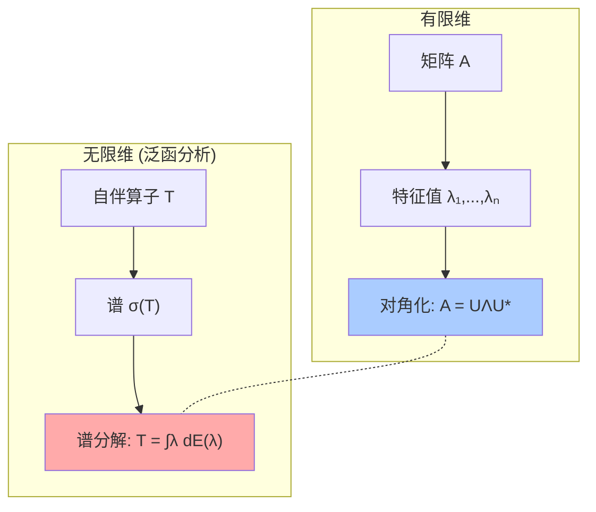

# 第9章 泛函与泛函分析

> "从有限维到无限维"——泛函分析是线性代数在无限维空间的自然推广。它把函数视作向量、把算子视作矩阵、把特征值推广为谱。量子力学、信号处理、偏微分方程的理论基础全部建立在此之上。

---

## 9.1 泛函：把函数映射为数

### 定义

**泛函** $J: V \to \mathbb{R}$（或 $\mathbb{C}$）——输入是函数，输出是数。

| 泛函 | 表达式 | 应用 |
|------|--------|------|
| 定积分 | $J[f] = \int_a^b f(x)dx$ | 面积 |
| 弧长 | $J[f] = \int_a^b \sqrt{1+f'(x)^2}dx$ | 最短路径 |
| 能量 | $J[f] = \int \|\nabla f\|^2 dx$ | Dirichlet 能量 |
| Dirac δ | $J[f] = f(0)$ | "在0处采样" |
| 最大范数 | $J[f] = \sup_x \|f(x)\|$ | 最坏情况 |

### 变分法：泛函的最优化

**Euler-Lagrange 方程**是变分法的核心结果。若 $J[y] = \int_a^b L(x, y, y')dx$ 在 $y(x)$ 处取极值，则：

$$
\frac{\partial L}{\partial y} - \frac{d}{dx}\left(\frac{\partial L}{\partial y'}\right) = 0
$$

> **物理意义**：将 $L$ 设为 Lagrangian = 动能 - 势能，Euler-Lagrange 方程就给出了系统的运动方程。这是从"最小作用量原理"推导牛顿力学、电磁学、广义相对论的基础。

```python
import sympy as sp

# Euler-Lagrange 方程的符号推导
x = sp.Symbol('x')
y = sp.Function('y')(x)
yp = sp.Derivative(y, x)

# 最短路径问题: L = sqrt(1 + (y')²)
L = sp.sqrt(1 + yp**2)

# Euler-Lagrange: ∂L/∂y - d/dx(∂L/∂y') = 0
dL_dy = sp.diff(L, y)
dL_dyp = sp.diff(L, yp)
# d/dx(∂L/∂y') 需要使用链式法则
print("∂L/∂y =", dL_dy)
print("∂L/∂y' =", dL_dyp)
print("→ 解为 y'' = 0 → y = mx + b (直线!)")
```

---

## 9.2 泛函分析：无限维空间上的分析学

### 核心研究对象

| 对象 | 有限维类比 | 无限维特征 |
|------|-----------|-----------|
| Banach空间 | $\mathbb{R}^n$ | 完备赋范空间 |
| Hilbert空间 | $\mathbb{R}^n$ 带内积 | 完备内积空间 |
| 线性算子 | 矩阵 $A \in M_{n\times n}$ | 微分/积分/乘法算子 |
| 有界算子 | — | $\|T\| = \sup_{\|x\|=1}\|Tx\| < \infty$ |
| 紧算子 | — | 有界集的像是相对紧的 |

### 四大核心定理

| 定理 | 陈述 | 用途 |
|------|------|------|
| **Hahn-Banach** | 子空间上的线性泛函可延拓到全空间 | 分离凸集，对偶理论 |
| **开映射** | Banach空间之间的连续线性满射把开集映到开集 | 逆算子连续性 |
| **闭图像** | 若算子的图像是闭集，则算子连续 | 验证无界算子的有界性 |
| **一致有界 (Banach-Steinhaus)** | 逐点有界 ⇒ 一致有界 | 处处收敛→算子族有界 |

> 这四大定理是泛函分析的"武功秘籍"——它们告诉你：在完备空间中，**逐点的性质往往能推出全局的性质**。

---

## 9.3 线性算子：无限维的"矩阵"

### 有界算子与无界算子的鸿沟

| 性质 | 有界算子 | 无界算子 |
|------|---------|---------|
| 连续性 | ✅ 必然连续 | ❌ 不连续 |
| 定义域 | 全空间 | 只能是稠密子空间 |
| 闭性 | 自动闭 | 需要验证闭性 |
| 谱 | 有界集 | 可为整个 $\mathbb{C}$ |

### 对偶空间与 Riesz 表示定理

$X$ 上的所有连续线性泛函构成**对偶空间** $X^*$。

**Riesz 表示定理**（Hilbert空间版本）：每个连续线性泛函 $f \in H^*$ 都可由内积表示为：

$$
f(x) = \langle x, y \rangle \quad \text{对某唯一的 } y \in H
$$

> 这意味着 Hilbert 空间中的"作用在向量上的泛函"本质上就是"与某个固定向量做内积"。$H \cong H^*$！

---

## 9.4 谱理论：特征值的终极推广

### 为什么需要谱？

在无限维空间中，算子 $T$ 的**谱** $\sigma(T)$ 推广了有限维中矩阵的**特征值集合**。但这里有一个关键区别：

$$
\lambda I - T \text{ 不可逆} \iff \lambda \in \sigma(T)
$$

在有限维中，"不可逆 = 有特征值"。在无限维中，不可逆的原因有三个层次：

| 谱的类型 | 含义 | 例子 |
|---------|------|------|
| **点谱** | $\lambda I - T$ 非单射 | 真正的特征值 |
| **连续谱** | 单射但值域稠密（却非满射） | 乘法算子 $(Tf)(x)=xf(x)$ |
| **剩余谱** | 单射但值域不稠密 | unilateral shift |

### 自伴算子的谱定理

若 $T = T^*$（自伴/ Hermitian），则：

1. $\sigma(T) \subseteq \mathbb{R}$
2. 不同特征值的特征向量正交
3. 存在**谱分解**：$T = \int_{\sigma(T)} \lambda \, dE(\lambda)$

> 谱分解是 Fourier 变换的终极推广——任何自伴算子都可以"对角化"为乘法算子。这就是为什么量子力学的可观测量必须用自伴算子表示：**谱 = 可能的测量值**。



### 紧算子的谱定理（Fredholm 理论）

紧算子是"最像矩阵"的无限维算子——它的谱除了可能的 $0$ 之外，完全由特征值构成：

$$
\sigma_{\text{ess}}(K) = \{0\}, \quad \sigma(K) \setminus \{0\} = \text{有限重特征值}
$$

> Fredholm 二择一（Fredholm alternative）：$(I-K)x = y$ 要么对任意 $y$ 有唯一解，要么齐次方程 $(I-K)x = 0$ 有非零解。这正是线性代数中"$\det A \neq 0$ 或 $\ker A \neq \{0\}$"的无限维版本。

```python
import numpy as np

# 演示: 紧算子 ≈ 可被有限秩算子逼近
# Fredholm 积分算子 (Ku)(x) = ∫₀¹ k(x,y)u(y)dy 是紧的

def fredholm_matrix(kernel, n=50):
    """离散化 Fredholm 积分算子为 n×n 矩阵"""
    x = np.linspace(0, 1, n)
    K = np.zeros((n, n))
    for i in range(n):
        for j in range(n):
            K[i,j] = kernel(x[i], x[j]) * (1.0/n)  # dx = 1/n
    return K

# 连续核: k(x,y) = min(x,y) (对应 -d²/dx² 的 Green 函数)
k = lambda x, y: min(x, y)
K = fredholm_matrix(k, 50)

# 特征值—→ 只有有限个大特征值（紧算子特征）
eigenvals = np.linalg.eigvalsh(K)
significant = eigenvals[abs(eigenvals) > 1e-3]
print(f"紧算子 K 的显著特征值 ({len(significant)}个):")
for i, ev in enumerate(sorted(significant, reverse=True)[:6]):
    print(f"  λ{i+1} = {ev:.6f}")
print(f"  ... (其余趋向于 0)")
```

---

## 9.5 本章关键点汇总

| # | 关键概念 | 直觉 | 连接章节 |
|---|---------|------|---------|
| 1 | **泛函 = 函数的函数** | 输入函数，输出数 | $\S$12 变分法 |
| 2 | **Euler-Lagrange** | 泛函极值的必要条件 | $\S$12, $\S$19 |
| 3 | **四大定理** | 完备性带来的"免费午餐" | $\S$2 Banach空间 |
| 4 | **Riesz表示** | $H \cong H^*$，泛函=内积 | $\S$2 Hilbert空间 |
| 5 | **谱 > 特征值** | 不可逆性的三层结构 | $\S$13 特征值 |
| 6 | **紧算子** | 无限维中最像矩阵的 | 积分方程 |
| 7 | **谱分解** | Fourier变换的终极推广 | $\S$5 变换 |

> 💡 **核心哲学**：泛函分析 = 无限维线性代数 + 拓扑完备性。有限维中的很多"理所当然"（如所有范数等价、线性算子自动连续）在无限维中全部失效。但也正是这些"失效"创造了丰富性——谱的三种类型、有界与无界算子的鸿沟、紧性与非紧性的分野，构成了现代分析的深层景观。
