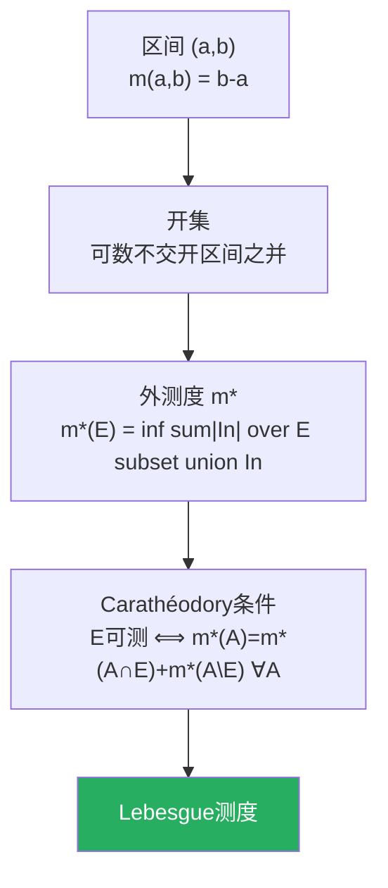
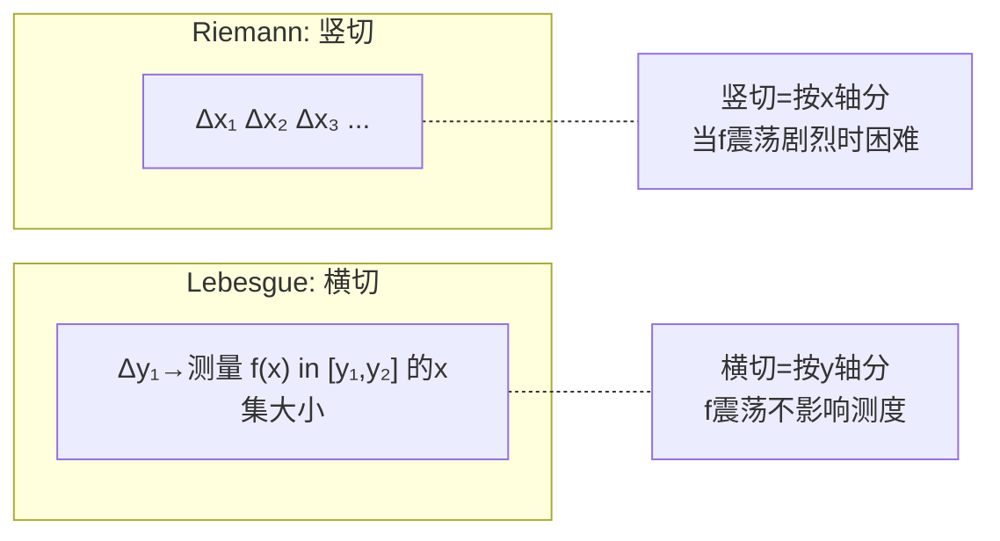

# 第10章 测度与积分

> Riemann 积分在19世纪末已不够用——它无法处理大量"不连续但有规律"的函数，也无法统一处理求和与积分。Lebesgue 的革命性思想：不是按"自变量的区间"分割，而是按"函数值的区间"分割。

---

## 10.1 测度：长度/面积/体积的抽象

### 测度空间的三要素

**测度空间** $(\Omega, \mathcal{F}, \mu)$：

| 要素 | 定义 | 直觉 |
|------|------|------|
| $\Omega$ | 基础集合 | "宇宙" |
| $\mathcal{F}$ | $\sigma$-代数 | "可测集的俱乐部" |
| $\mu$ | 测度函数 $\mathcal{F} \to [0,\infty]$ | 给每个可测集赋大小 |

### $\sigma$-代数的公理

1. $\Omega \in \mathcal{F}$
2. $A \in \mathcal{F} \Rightarrow A^c \in \mathcal{F}$（对补封闭）
3. $A_1,A_2,\ldots \in \mathcal{F} \Rightarrow \bigcup_{n=1}^\infty A_n \in \mathcal{F}$（对可数并封闭）

### 测度的公理

1. $\mu(\emptyset) = 0$
2. **可数可加性**：对两两不交的 $\{A_n\}$，$\mu(\bigcup A_n) = \sum \mu(A_n)$

> 可数可加性是 Lebesgue 测度的精髓——它允许"可数无穷"的运算，而 Riemann 积分只能处理"有限"的分割。

### Lebesgue 测度的构造（直觉版）

在 $\mathbb{R}$ 上：先用区间长度定义"外测度"，然后说一个集合可测当且仅当它能被开集从外、闭集从内充分逼近。



---

## 10.2 可测函数

函数 $f: \Omega \to \mathbb{R}$ 是**可测的**，如果对任意实数 $\alpha$：

$$
\{x : f(x) > \alpha\} \in \mathcal{F}
$$

> 可测函数是"可被积分的函数"——它们不必连续，但必须有足够的"规律性"使积分有意义。连续函数、单调函数、逐点极限都是可测的。

---

## 10.3 Lebesgue 积分：按值域分割

### Riemann vs Lebesgue

| 视角 | Riemann 积分 | Lebesgue 积分 |
|------|-------------|--------------|
| 分割什么 | 定义域（$x$ 轴） | 值域（$y$ 轴） |
| 求和方式 | $\sum f(x_i^*) \Delta x$ | $\sum y_i \cdot \mu(f^{-1}([y_i,y_{i+1}]))$ |
| 可积的充要条件 | 几乎处处连续 | 可测即可 |

> **Lebesgue 的核心洞察**：不要问"$x$ 到 $x+\Delta x$ 之间函数值是多少"，而要问"函数值落在 $[y, y+\Delta y]$ 之间的 $x$ 的集合有多大"。




### 三大收敛定理

| 定理 | 条件 | 结论 |
|------|------|------|
| **单调收敛** | $0 \leq f_n \uparrow f$ | $\int f_n \to \int f$ |
| **Fatou 引理** | $f_n \geq 0$ | $\int \liminf f_n \leq \liminf \int f_n$ |
| **控制收敛 (DCT)** | $\|f_n\| \leq g$, $\int g < \infty$ | $\int f_n \to \int f$ |

> **DCT 是 Lebesgue 理论的"王牌"**——只要有可积的控制函数，极限和积分就可以交换。这对于 Fourier 分析、概率论、PDE 都是无价之宝。

```python
import numpy as np

# Lebesgue 积分的直觉：按 y 轴分层
def lebesgue_style_integral(f, a, b, n_strips=1000):
    """模拟 Lebesgue 积分的'横切'思想"""
    x = np.linspace(a, b, 10000)
    y = f(x)
    
    y_min, y_max = y.min(), y.max()
    dy = (y_max - y_min) / n_strips
    integral = 0
    
    for i in range(n_strips):
        y_low = y_min + i * dy
        y_high = y_low + dy
        # 测量 {x: f(x) ∈ [y_low, y_high]} 的大小
        measure = np.sum((y >= y_low) & (y < y_high)) * (b-a)/len(x)
        integral += y_low * measure
    
    return integral

f = lambda x: x**2
print("∫₀¹ x² dx:")
print(f"  Lebesgue风格: {lebesgue_style_integral(f, 0, 1):.6f}")
print(f"  精确值 1/3:    {1/3:.6f}")
```

---

## 10.4 $L^p$ 空间

### 定义

$$
L^p(\Omega) = \left\{f \text{ 可测} \;\middle|\; \int_\Omega |f|^p d\mu < \infty\right\}
$$

| 空间 | 范数 | 特殊性质 |
|------|------|---------|
| $L^1$ | $\|f\|_1 = \int \|f\|$ | 可积函数 |
| $L^2$ | $\|f\|_2 = \sqrt{\int \|f\|^2}$ | **Hilbert空间！** |
| $L^\infty$ | $\|f\|_\infty = \text{ess sup}\|f\|$ | 本质有界 |
| $L^p$ ($1<p<\infty$) | $(\int \|f\|^p)^{1/p}$ | 自反 Banach空间 |

### Hölder 不等式（Cauchy-Schwarz 的推广）

$$
\int |fg| \leq \|f\|_p \|g\|_q, \quad \frac{1}{p} + \frac{1}{q} = 1
$$

$p=q=2$ 时退化为 Cauchy-Schwarz 不等式。

---

## 10.5 概率测度：测度论的概率意义

**概率空间** = 测度空间 $(\Omega, \mathcal{F}, P)$ 其中 $P(\Omega) = 1$。

| 测度论概念 | 概率论对应 |
|-----------|-----------|
| 可测集 $A$ | 事件 |
| 测度 $\mu(A)$ | 概率 $P(A)$ |
| 可测函数 $f$ | 随机变量 $X$ |
| 积分 $\int f d\mu$ | 期望 $\mathbb{E}[X]$ |
| 几乎处处 | 几乎必然 (a.s.) |
| $L^2$ 范数 | 标准差 |

> Kolmogorov (1933) 用测度论公理化概率论，是20世纪数学最成功的"跨界"之一。$\S$14 将在这个框架下展开。

---

## 10.6 本章关键点汇总

| # | 关键概念 | 直觉 | 连接章节 |
|---|---------|------|---------|
| 1 | **$\sigma$-代数** | "可测集"的封闭俱乐部 | $\S$14 概率 |
| 2 | **可数可加性** | Lebesgue测度的灵魂 | 全书分析基础 |
| 3 | **横切 vs 竖切** | Lebesgue 按 y 轴分 | $\S$12 积分 |
| 4 | **三大收敛定理** | MCT, Fatou, DCT | 分析学核心工具 |
| 5 | **$L^p$ 空间** | 可测函数的赋值范分类 | $\S$2, $\S$9 |
| 6 | **概率空间 = 测度空间** | Kolmogorov公理化 | $\S$14 |

> 💡 **核心哲学**：测度论是"大小"概念的终极形式——它告诉我们什么集合可以被赋予大小，以及这个大小如何同极限、求和、积分和谐共处。Lebesgue 的横切思想不仅统一了积分理论，还为概率论提供了公理基础。
