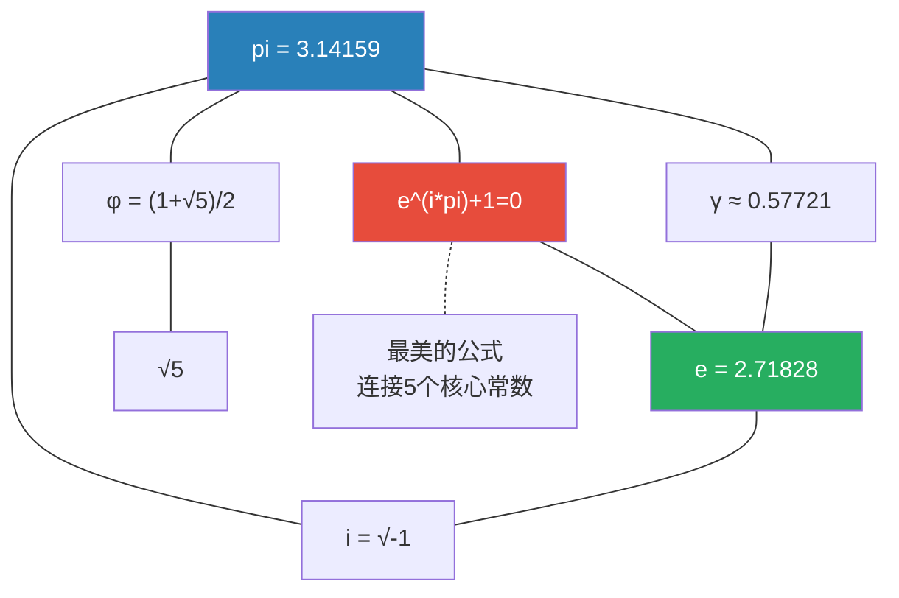

# 第11章 常数

> 数学中有一组特殊的数——它们不是被任意定义的，而是在完全不同的数学情境中反复"自然涌现"。这些常数是数学结构的"DNA"，连接着看似毫无关联的领域。

---

## 11.1 $\pi$：圆与周期的常数

### 几何定义

$$
\pi = \frac{\text{圆周长}}{\text{直径}}
$$

### $\pi$ 的无处不在

$\pi$ 出现在看似与圆无关的地方：

| 公式 | 领域 | 为什么有 $\pi$？ |
|------|------|-----------------|
| $\sum_{n=1}^\infty \frac{1}{n^2} = \frac{\pi^2}{6}$ | 数论/级数 | Basel 问题 |
| $\int_{-\infty}^\infty e^{-x^2}dx = \sqrt{\pi}$ | 概率/分析 | Gaussian 积分 |
| $\frac{1}{\pi} = \frac{2\sqrt{2}}{9801}\sum_{k=0}^\infty \frac{(4k)!(1103+26390k)}{(k!)^4 396^{4k}}$ | 数值计算 | Ramanujan 公式 |
| $\Gamma(\frac{1}{2}) = \sqrt{\pi}$ | 特殊函数 | Gamma 函数 |
| $\prod_{p\text{ prime}} \left(1-\frac{1}{p^2}\right)^{-1} = \frac{\pi^2}{6}$ | 数论 | Euler 乘积 |

> $\pi$ 在 Basel 问题中的出现是深层的：$\sum 1/n^2$ 是一个"离散的和"，但答案却包含 $\pi$——连续几何的常数。这就是分析学中"离散→连续"联系的经典案例。

---

## 11.2 $e$：自然增长的常数

### 来源定义

$$
e = \lim_{n\to\infty} \left(1 + \frac{1}{n}\right)^n = \sum_{n=0}^\infty \frac{1}{n!} \approx 2.71828\ldots
$$

### $e$ 的独特性质

$e^x$ 是唯一一个**导数等于自身**的函数：

$$
\frac{d}{dx} e^x = e^x
$$

这意味着 $e$ 是描述"变化率与当前值成正比"的自然底数——复利、人口增长、放射性衰变、RC电路都遵循 $e$ 的模式。

### $e$ 与复数的结合：欧拉公式的证明

从 $e^x$、$\sin x$、$\cos x$ 的 Taylor 级数：

$$
\begin{aligned}
e^{i\theta} &= \sum_{n=0}^\infty \frac{(i\theta)^n}{n!} = \sum_{k=0}^\infty \left[\frac{(i\theta)^{2k}}{(2k)!} + \frac{(i\theta)^{2k+1}}{(2k+1)!}\right] \\
&= \sum_{k=0}^\infty \frac{(-1)^k\theta^{2k}}{(2k)!} + i\sum_{k=0}^\infty \frac{(-1)^k\theta^{2k+1}}{(2k+1)!} \\
&= \cos\theta + i\sin\theta
\end{aligned}
$$

令 $\theta = \pi$，得到 **$e^{i\pi} + 1 = 0$**。


---

## 11.3 $i$：虚数单位

$i = \sqrt{-1}$ 是"方向"的常数——乘以 $i$ = 逆时针旋转 $90^\circ$。

| 幂次 | 值 | 几何意义 |
|:---:|-----|---------|
| $i^1$ | $i$ | 旋转90° |
| $i^2$ | $-1$ | 旋转180° |
| $i^3$ | $-i$ | 旋转270° |
| $i^4$ | $1$ | 旋转360°=回到原点 |

> $i$ 和 $e$ 通过欧拉公式组合后，统一了代数（多项式方程 $x^2+1=0$）、几何（旋转）、分析（指数/三角函数的统一）。

---

## 11.4 $\gamma$：Euler-Mascheroni 常数

$$
\gamma = \lim_{n\to\infty} \left(\sum_{k=1}^n \frac{1}{k} - \ln n\right) \approx 0.57721\ldots
$$

$\gamma$ 衡量了**调和级数的部分和与自然对数的渐近差距**。至今不知道 $\gamma$ 是有理数还是无理数——这是数学中著名的未解决问题之一。

### $\gamma$ 的出现场景

- $\Gamma'(1) = -\gamma$（Gamma 函数的导数）
- $\int_0^\infty e^{-x}\ln x \,dx = -\gamma$
- 素数分布：$\prod_{p \leq n} \left(1-\frac{1}{p}\right)^{-1} \sim e^\gamma \ln n$

---

## 11.5 $\varphi$：黄金比例

$$
\varphi = \frac{1+\sqrt{5}}{2} \approx 1.61803\ldots
$$

### $\varphi$ 的性质

- **二次方程根**：$\varphi^2 = \varphi + 1$
- **连分数**（最简单的无限连分数）：$\varphi = 1 + \frac{1}{1+\frac{1}{1+\cdots}}$
- **与 Fibonacci 的关系**：$F_n = \frac{\varphi^n - (-\varphi)^{-n}}{\sqrt{5}}$

### 为什么"黄金"？

一个矩形的长宽比为 $\varphi$ 时，去掉一个正方形后，剩下的小矩形与原矩形相似——这种自相似性是 $\varphi$ 的本质。

---

## 11.6 常数的关系网



### 五大常数一览表

| 常数 | 值 | 本质 | 核心公式 | 是否超越？ |
|------|-----|------|---------|:---:|
| $\pi$ | 3.14159... | 圆/周期 | $C = 2\pi r$ | ✅ (Lindemann 1882) |
| $e$ | 2.71828... | 自然增长 | $\frac{d}{dx}e^x = e^x$ | ✅ (Hermite 1873) |
| $i$ | $\sqrt{-1}$ | 旋转 | $i^2 = -1$ | 代数数 |
| $\gamma$ | 0.57721... | 离散-连续差距 | $H_n - \ln n \to \gamma$ | **未知！** |
| $\varphi$ | 1.61803... | 自相似比例 | $\varphi^2 = \varphi + 1$ | 代数数 |

```python
import math

# 常数的数值验证
print("π =", math.pi)
print("e =", math.e)

# 欧拉公式验证
print(f"e^(iπ) + 1 = {abs(math.e**(1j*math.pi) + 1):.1e} ≈ 0")

# Euler-Mascheroni 常数近似
n = 1000000
harmonic = sum(1/k for k in range(1, n+1))
gamma_approx = harmonic - math.log(n)
print(f"γ ≈ {gamma_approx:.6f} (精确值: 0.577216)")

# 黄金比例
phi = (1 + math.sqrt(5)) / 2
print(f"φ = {phi:.6f}")
print(f"φ² = {phi**2:.6f}, φ+1 = {phi+1:.6f} (相等!)")
```

---

## 11.7 本章关键点汇总

| # | 关键概念 | 直觉 | 连接章节 |
|---|---------|------|---------|
| 1 | **$\pi$** | 圆→周期→无处不在 | $\S$3 级数, $\S$5 Fourier |
| 2 | **$e$** | 导数等于自身的函数底数 | $\S$12 微积分 |
| 3 | **$e^{i\pi}+1=0$** | 五常数统一 | $\S$1 复数 |
| 4 | **$\gamma$** | 调和级数与对数的差距 | $\S$3 级数, $\S$15 数论 |
| 5 | **$\varphi$** | 自相似性的数学化身 | $\S$6 几何 |

> 💡 **核心哲学**：数学常数不是"某个聪明人定义的数值"，而是在探索完全不同的数学问题时反复出现的"必然数值"。$\pi$ 在 Basel 问题中的出现暗示了离散求和与连续几何之间尚未完全理解的深层联系——这正是数学统一性的魅力所在。
