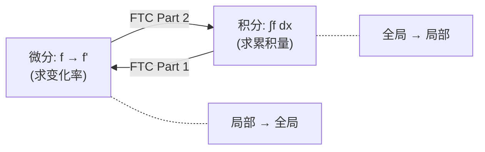

# 第12章 微积分

> Newton 和 Leibniz 在17世纪末独立发明的微积分，本质上回答了两个互逆的问题：如何从位置求速度（微分），以及如何从速度求位移（积分）。这两个看似相反的操作之间的联系——微积分基本定理——是人类智慧最美的发现之一。

---

## 12.1 导数：瞬时变化率

### 定义

$$
f'(x) = \lim_{h \to 0} \frac{f(x+h) - f(x)}{h}
$$

**几何意义**：切线斜率。**物理意义**：瞬时速度。

### 微分 = 局部线性近似

微分 $df = f'(x)dx$ 给出了函数在 $x$ 附近的最佳线性近似：

$$
f(x+h) \approx f(x) + f'(x)h
$$

这正是 Taylor 展开的一阶项——所有的局部信息都编码在导数中。

### 基本导数表

| $f(x)$ | $f'(x)$ | 记忆法 |
|--------|---------|--------|
| $x^n$ | $nx^{n-1}$ | 指数前移，降一次 |
| $e^x$ | $e^x$ | 不变！ |
| $\ln x$ | $1/x$ | 反比例 |
| $\sin x$ | $\cos x$ | 前移 $\pi/2$ |
| $\cos x$ | $-\sin x$ | 前移 $\pi/2$ |

---

## 12.2 积分：累积量

### Riemann 积分的极限定义

$$
\int_a^b f(x)dx = \lim_{\|\Delta x\| \to 0} \sum_{i=1}^n f(x_i^*)\Delta x_i
$$

### 微积分基本定理 (FTC)

> **Part 1（微分是积分的逆）**：若 $F(x) = \int_a^x f(t)dt$，则 $F'(x) = f(x)$。
>
> **Part 2（积分是微分的逆）**：$\int_a^b F'(x)dx = F(b) - F(a)$。



> FTC 是一条"数学守恒律"——变化率的累积等于总量的变化。这在一个公式中统一了几何（面积）、物理（功）、概率（分布函数）。

```python
import sympy as sp

x = sp.Symbol('x')

# FTC 演示：微分与积分的互逆
f = sp.sin(x)
F = sp.integrate(f, x)  # 不定积分
F_prime = sp.diff(F, x)  # 再求导

print(f"f(x) = {f}")
print(f"∫f dx = {F}")
print(f"d/dx(∫f dx) = {F_prime}")
print(f"是否等于原函数？ {sp.simplify(F_prime - f) == 0}")

# 定积分 FTC Part 2
a, b = 0, sp.pi/2
definite = sp.integrate(f, (x, a, b))
antiderivative = sp.integrate(f, x)
ftc = antiderivative.subs(x, b) - antiderivative.subs(x, a)
print(f"\n∫₀^(π/2) sin(x)dx = {definite}")
print(f"F(π/2) - F(0) = {ftc}")
```

---

## 12.3 多变量微积分

### 偏导数与梯度

$$
\nabla f = \left(\frac{\partial f}{\partial x_1}, \ldots, \frac{\partial f}{\partial x_n}\right)
$$

**梯度指向函数增长最快的方向**。这是 $\S$19 优化中梯度下降法的基础。

### 散度与旋度

| 算子 | 作用 | 物理意义 |
|------|------|---------|
| 散度 $\nabla \cdot \mathbf{F}$ | 向量场→标量场 | "源"的强度 |
| 旋度 $\nabla \times \mathbf{F}$ | 向量场→向量场 | "旋转"的强度 |

### Green / Stokes / Gauss 定理——FTC 的多维推广

这三个定理本质上都说同一件事：**边界上的积分 = 内部微分的积分**。

| 定理 | 空间 | 公式 |
|------|------|------|
| Green | $\mathbb{R}^2$ | $\oint_{\partial D} Pdx+Qdy = \iint_D (Q_x-P_y)dA$ |
| Stokes | $\mathbb{R}^3$ (曲面) | $\oint_{\partial S} \mathbf{F}\cdot d\mathbf{r} = \iint_S (\nabla \times \mathbf{F})\cdot d\mathbf{S}$ |
| Gauss | $\mathbb{R}^3$ (体) | $\iint_{\partial V} \mathbf{F}\cdot d\mathbf{S} = \iiint_V \nabla\cdot\mathbf{F} \,dV$ |

> 这三个定理在微分形式的语言下统一为 **Stokes 定理的广义形式**：
> $$\int_{\partial M} \omega = \int_M d\omega$$
> 这是现代微分几何和拓扑学的统一公式（$\S$6, $\S$7）。

---

## 12.4 变分法：函数的"导数"

### 基本问题

找到一个函数 $y(x)$ 使得泛函 $J[y] = \int_a^b L(x, y, y')dx$ 取极值。

**Euler-Lagrange 方程**（$\S$9 的再访）：

$$
\frac{\partial L}{\partial y} - \frac{d}{dx}\left(\frac{\partial L}{\partial y'}\right) = 0
$$

### 经典应用

| 问题 | Lagrangian $L$ | EL 方程的解 |
|------|---------------|------------|
| 最短路径 | $\sqrt{1+y'^2}$ | $y = mx + b$（直线） |
| 最速降线 | $\sqrt{(1+y'^2)/y}$ | 摆线 |
| 最小旋转面 | $y\sqrt{1+y'^2}$ | 悬链线 $y = a\cosh(x/a)$ |
| 经典力学 | $T - V$（动能-势能） | Newton 第二定律 |

```python
# 变分法的数值近似：直接法
import numpy as np

def functional_value(y_points, L_func, dx):
    """计算离散泛函 J[y] 的值"""
    n = len(y_points)
    J = 0
    for i in range(n-1):
        y = y_points[i]
        yp = (y_points[i+1] - y_points[i]) / dx
        J += L_func(y, yp) * dx
    return J

# 最短路径: L(y, y') = sqrt(1 + y'²)
L_shortest = lambda y, yp: np.sqrt(1 + yp**2)

# 直线 y=0 (最短) vs 正弦曲线
x = np.linspace(0, 1, 100)
y_straight = np.zeros(100)
y_wavy = 0.2 * np.sin(2*np.pi*x)

J_straight = functional_value(y_straight, L_shortest, 0.01)
J_wavy = functional_value(y_wavy, L_shortest, 0.01)
print(f"直线路径 J = {J_straight:.4f}")
print(f"波浪路径 J = {J_wavy:.4f}")
print(f"直线更短: {'✓' if J_straight < J_wavy else '✗'}")
```

---

## 12.5 本章关键点汇总

| # | 关键概念 | 直觉 | 连接章节 |
|---|---------|------|---------|
| 1 | **FTC** | 微分和积分互逆——数学的核心对偶 | $\S$5 Fourier变换 |
| 2 | **导数 = 局部线性近似** | $f(x+h) \approx f(x) + f'(x)h$ | $\S$19 优化 |
| 3 | **Green/Stokes/Gauss** | 边界积分 = 内部微分的积分 | $\S$7 拓扑 |
| 4 | **Euler-Lagrange** | 泛函极值的"导数"条件 | $\S$9 泛函分析 |
| 5 | **微分形式** | 统一所有积分定理 | $\S$6, $\S$7 |
| 6 | **梯度下降** | 沿负梯度方向→局部最小 | $\S$19 优化 |

> 💡 **核心哲学**：微积分的核心是"局部决定全局"——导数是局部概念（只关心一点附近），但 FTC 让局部变化率的累积等于全局变化量。这个"局部-全局对偶"贯穿所有数学分支：微分vs积分、梯度vs散度定理、曲率vs Gauss-Bonnet 定理。
