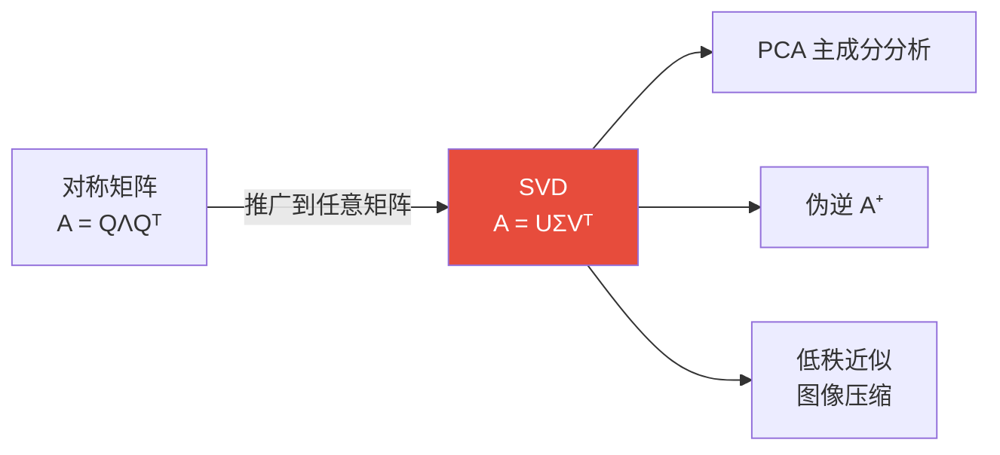

# 第13章 线性代数

> "线性"是数学中最简单也最强大的关系——叠加原理使得复杂问题可以被分解为简单部分的线性组合。线性代数研究向量空间和它们之间的线性变换，是一切应用数学的基础语言。

---

## 13.1 向量：方向与量的统一

### 向量的公理化定义

向量是**向量空间**中的元素——它不一定是"箭头"：

- $\mathbb{R}^n$ 中的坐标元组
- 多项式：$p(x) = a_0 + a_1x + \cdots + a_nx^n$
- 连续函数：$f \in C[0,1]$
- 矩阵：$A \in M_{m \times n}$
- 量子态：$|\psi\rangle$ 在 Hilbert 空间中

> 只要满足"可加、可数乘"的八条公理（$\S$2.3），就是向量。

---

## 13.2 矩阵：线性变换的具体表示

### 矩阵 = 线性变换 + 选定基

$$
T: V \to W \text{ (线性)} \xrightarrow{\text{选定基}} A \in M_{m \times n}
$$

矩阵乘法的定义 $C_{ij} = \sum_k A_{ik} B_{kj}$ 并非随意——它是**线性变换复合**的自然结果。

### 矩阵的关键不变量

| 不变量 | 含义 | 计算 |
|--------|------|------|
| **秩** $r(A)$ | 线性独立的列（行）数 | 消元法 |
| **行列式** $\det A$ | 体积的缩放因子 | 递推展开 |
| **迹** $\text{tr}(A)$ | 对角线元素之和 | $\sum a_{ii}$ |
| **特征值** $\lambda_i$ | 变换的本质方向 | $\det(A - \lambda I) = 0$ |

---

## 13.3 行列式：体积的故事

### 几何解释

$|\det A| = n$ 维平行多面体的**有向体积**。

$$
\det A = 0 \iff A \text{ 不可逆} \iff \text{体积变为 } 0 \iff \ker A \neq \{0\}
$$

### 行列式的关键性质

| 性质 | 描述 |
|------|------|
| $\det(AB) = \det A \cdot \det B$ | 复合变换的体积缩放 = 缩放之积 |
| $\det(A^T) = \det A$ | 转置不变 |
| $\det(cA) = c^n \det A$ | 标量乘法对 $n$ 维体积的影响 |
| 反对称 | 交换两行→行列式变号 |

---

## 13.4 特征值与特征向量

### 定义

$$
A\mathbf{v} = \lambda \mathbf{v}, \quad \mathbf{v} \neq \mathbf{0}
$$

> 特征方向 = 线性变换中**方向不变**的轴；特征值 = 沿该轴的**拉伸倍率**。

### 谱定理（对称矩阵的对角化）

若 $A = A^T$（实对称），则：

1. 所有特征值都是**实数**
2. 不同特征值的特征向量相互**正交**
3. $A = Q\Lambda Q^T$（正交对角化）

### 奇异值分解 (SVD)：任意矩阵的"谱定理"

对于**任意**矩阵 $A \in M_{m \times n}$：

$$
A = U \Sigma V^T
$$

- $U$：$m \times m$ 正交（左奇异向量）
- $\Sigma$：$m \times n$ 对角（奇异值 $\sigma_i \geq 0$）
- $V$：$n \times n$ 正交（右奇异向量）

> SVD 是线性代数的"瑞士军刀"——PCA、伪逆、低秩近似、图像压缩都建立在此之上。




```python
import numpy as np

# SVD 演示：图像压缩
np.random.seed(42)
# 创建一个简单的"图像"矩阵 (50×30)
img = np.zeros((50, 30))
img[10:40, 5:10] = 1   # 竖条
img[20:25, 10:25] = 1  # 横条

U, S, Vt = np.linalg.svd(img, full_matrices=False)

# 用前 k 个奇异值重构
for k in [1, 3, 5, 10]:
    approx = U[:, :k] @ np.diag(S[:k]) @ Vt[:k, :]
    error = np.linalg.norm(img - approx, 'fro')
    print(f"k={k:2d}: 误差={error:.4f}, 压缩比={k*(50+30+1)/(50*30):.2%}")
```

---

## 13.5 张量：多线性关系的语言

### 定义

**张量** = 多线性映射的多维数组表示。

| 阶 | 名称 | 例子 |
|:---:|------|------|
| 0 | 标量 | 温度值 |
| 1 | 向量 | 力、速度 |
| 2 | 矩阵 | 应力张量、惯性张量 |
| 3+ | 高阶张量 | Riemann 曲率张量、RGB 图像 |

> 张量的核心操作——**缩并**（contraction）——沿某一维度求和，降低两阶。矩阵乘法就是行向量与列向量的缩并。

---

## 13.6 本章关键点汇总

| # | 关键概念 | 直觉 | 连接章节 |
|---|---------|------|---------|
| 1 | **向量空间公理** | 可加可缩的世界 | $\S$2 空间 |
| 2 | **矩阵 = 线性变换 + 基** | 基的选择决定矩阵形式 | $\S$8 表示论 |
| 3 | **行列式 = 体积** | $\det=0$ = 降维 | $\S$6 几何 |
| 4 | **谱定理** | 对称矩阵可正交对角化 | $\S$9 谱理论 |
| 5 | **SVD** | 任意矩阵的"谱定理" | 数据科学 |
| 6 | **特征值/向量** | 变换的本质方向 | $\S$9 谱理论 |

> 💡 **核心哲学**：线性代数的力量在于它将"变换"和"坐标"分离——同一个线性变换在不同基下有不同的矩阵表示，但它的本质（秩、特征值、行列式）是基无关的。这就是为什么"找好的基"（对角化、正交化、SVD）是线性代数的核心技能。
