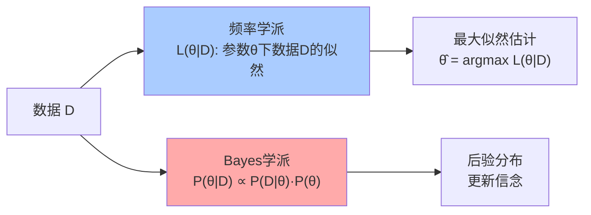

# 第14章 概率与统计

> 概率论量化不确定性，统计学从数据中推断真相。Kolmogorov 1933年的测度论公理化让概率论成为一门严谨的数学分支，而 Bayes 定理则提供了更新信念的逻辑框架。

---

## 14.1 概率的公理化（Kolmogorov）

### 概率空间

$$
(\Omega, \mathcal{F}, P)
$$

- $\Omega$：样本空间（所有可能结果）
- $\mathcal{F}$：事件域（$\sigma$-代数）
- $P: \mathcal{F} \to [0,1]$：概率测度，$P(\Omega) = 1$

### 公理

1. $P(A) \geq 0$
2. $P(\Omega) = 1$
3. **可数可加性**：互斥事件的可数并的概率 = 概率的和

> 这一公理化将概率论无缝嵌入测度论（$\S$10）——概率就是总质量为1的特殊测度。

---

## 14.2 随机变量与分布

### 随机变量 = 可测函数

$$
X: \Omega \to \mathbb{R}
$$

### 核心分布族

| 分布 | 记号 | $E[X]$ | 用途 |
|------|------|--------|------|
| 二项 | $B(n,p)$ | $np$ | 成功次数 |
| Poisson | $\text{Pois}(\lambda)$ | $\lambda$ | 稀有事件 |
| 正态 | $N(\mu,\sigma^2)$ | $\mu$ | 自然界的"默认"分布 |
| 指数 | $\text{Exp}(\lambda)$ | $1/\lambda$ | 等待时间 |
| 均匀 | $U(a,b)$ | $(a+b)/2$ | 等可能 |

### 中心极限定理 (CLT)

> 大量独立同分布随机变量的和（经标准化）趋近于标准正态分布：

$$
\frac{\sum_{i=1}^n X_i - n\mu}{\sigma\sqrt{n}} \xrightarrow{d} N(0,1)
$$

**这是为什么正态分布无所不在的原因**——任何由大量微小独立因素叠加产生的量，无论各因素原来是什么分布，总和都近似正态。


---

## 14.3 期望、方差、协方差

$$
E[X] = \int_\Omega X dP, \quad \text{Var}(X) = E[(X - E[X])^2]
$$

| 量 | 含义 | 性质 |
|----|------|------|
| 期望 | 长期平均 | 线性：$E[aX+bY] = aE[X]+bE[Y]$ |
| 方差 | 离散程度 | $\text{Var}(X) = E[X^2] - (E[X])^2$ |
| 协方差 | 线性关联 | $\text{Cov}(X,Y) = E[XY] - E[X]E[Y]$ |
| 相关系数 | 标准化的关联 | $\rho \in [-1,1]$ |

---

## 14.4 条件概率与 Bayes 定理

### 条件概率

$$
P(A|B) = \frac{P(A \cap B)}{P(B)}
$$

### Bayes 定理——信念更新的数学

$$
P(H|E) = \frac{P(E|H) \cdot P(H)}{P(E)}
$$

- $P(H)$ = **先验**（看到证据前相信假设的概率）
- $P(E|H)$ = **似然**（假设成立时证据出现的概率）
- $P(H|E)$ = **后验**（看到证据后相信假设的概率）

> Bayes 定理是科学推理的数学引擎——它告诉你如何在新证据面前理性地更新信念。

---

## 14.5 随机过程

### 定义

**随机过程** $\{X_t\}_{t \in T}$ = 一族随时间演化的随机变量。

### Markov 链

未来只依赖于现在，不依赖于过去：

$$
P(X_{n+1} = j \mid X_n = i, X_{n-1}, \ldots) = P(X_{n+1} = j \mid X_n = i)
$$

**平稳分布** $\pi$ 满足 $\pi = \pi P$（$P$ 是转移矩阵）。这是 PageRank、MCMC 等算法的数学基础。

### Brown 运动 (Wiener 过程)

- $B_0 = 0$
- 独立增量：$B_t - B_s \sim N(0, t-s)$
- 连续但**处处不可微**的样本路径

> Brown 运动是随机微积分的核心对象——它是 Black-Scholes 期权定价公式的底层模型。

```python
import numpy as np

def brownian_motion(n_steps, dt=0.01):
    """模拟一维 Brown 运动"""
    dW = np.random.normal(0, np.sqrt(dt), n_steps)
    W = np.cumsum(dW)
    W = np.insert(W, 0, 0)
    return W

# 模拟并显示性质
np.random.seed(42)
W = brownian_motion(1000)
print(f"W(10) 的模拟值: {W[-1]:.3f}")
print(f"理论: W(10) ~ N(0, 10)")

# 重采样验证正态性
W_T = [brownian_motion(1000)[-1] for _ in range(5000)]
print(f"均值: {np.mean(W_T):.3f} (理论 0)")
print(f"标准差: {np.std(W_T):.3f} (理论 √10 ≈ {np.sqrt(10):.3f})")
```

---

## 14.6 统计推断的两大范式

| 范式 | 核心思想 | 工具 |
|------|---------|------|
| **频率学派** | 概率 = 长期频率；参数是固定值 | MLE, 假设检验, 置信区间 |
| **Bayes学派** | 概率 = 信念度；参数是随机变量 | 先验→后验, 可信区间 |



---

## 14.7 本章关键点汇总

| # | 关键概念 | 直觉 | 连接章节 |
|---|---------|------|---------|
| 1 | **概率空间 = 测度空间** | Kolmogorov公理化 | $\S$10 测度论 |
| 2 | **CLT** | 大量微小因素 → 正态 | 统计推断基石 |
| 3 | **Bayes定理** | 信念更新的数学 | 机器学习 |
| 4 | **Markov链** | 未来只依赖现在 | $\S$16 图论 |
| 5 | **Brown运动** | 连续但处处不可微 | 随机微积分 |

> 💡 **核心哲学**：概率论不是关于"随机性"的理论——它是关于**信息不完整时如何进行理性推理**的理论。CLT 告诉我们为什么正态分布到处出现，Bayes定理告诉我们如何用数据更新认知，Markov链告诉我们复杂系统如何随时间演化。
