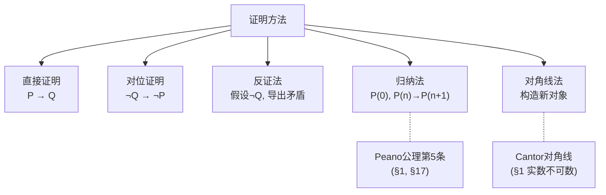

# 第17章 逻辑与集合

> 数学的基础是什么？20世纪初，数学家试图用集合论和数理逻辑为整个数学大厦奠基。这个野心勃勃的工程虽然被 Gödel 的不完备定理所撼动，但它彻底改变了我们理解"证明""真理""可计算"的方式。

---

## 17.1 集合论：数学的通用语言

### 朴素集合论 vs 公理化集合论

**朴素**："集合是任意一些对象的汇集" → **Russell 悖论**：$R = \{x \mid x \notin x\}$，则 $R \in R \iff R \notin R$。

**ZFC 公理系统**（Zermelo-Fraenkel + Choice）：用9条公理限制"集合"的构造方式，避免悖论。

### ZFC 的核心公理（简化）

| 公理 | 含义 |
|------|------|
| **外延** | 有相同元素的集合相等 |
| **空集** | $\emptyset$ 存在 |
| **配对** | $\{a,b\}$ 存在 |
| **并集** | $\bigcup A$ 存在 |
| **幂集** | $\mathcal{P}(A)$ 存在 |
| **无穷** | 存在无穷集 |
| **替换** | 用公式定义的"映射"产生集合 |
| **正则** | 无 $\in$ 无穷降链（禁止 $x \in x$） |
| **选择** | 可从一族非空集中各选一元素 |

### 序数与基数

- **序数** = 良序集的"序型"——von Neumann 构造：$0=\emptyset, 1=\{0\}, 2=\{0,1\},\ldots$
- **基数** = 集合的"大小"——$\aleph_0 = |\mathbb{N}|$

> **连续统假设（CH）**：是否存在集合大小严格介于 $|\mathbb{N}|$ 和 $|\mathbb{R}|$ 之间？Cohen (1963) 证明 CH 独立于 ZFC——既不能被证明也不能被证否。这是 $\S$17 的核心戏剧：**有些数学命题在标准公理下无法判定**。

---

## 17.2 命题逻辑与谓词逻辑

### 命题逻辑

| 连接词 | 符号 | 真值表 |
|--------|------|--------|
| 否定 | $\neg P$ | 反转真值 |
| 合取 | $P \land Q$ | 都真才真 |
| 析取 | $P \lor Q$ | 有一真即真 |
| 蕴含 | $P \to Q$ | $P$假或$Q$真 |
| 等价 | $P \leftrightarrow Q$ | 同真同假 |

### 谓词逻辑 = 命题逻辑 + 量词

- **全称量词** $\forall x: P(x)$ —— "对所有$x$..."
- **存在量词** $\exists x: P(x)$ —— "存在$x$..."

> 谓词逻辑的表达力远超命题逻辑——它可以表达"极限存在""函数连续"等复杂陈述，这些在命题逻辑中需要无穷长公式。

---

## 17.3 证明方法

### 常用证明技术

| 方法 | 逻辑结构 | 经典案例 |
|------|---------|---------|
| **直接证明** | $P \to Q$ | 从前提推结论 |
| **反证法** | 假设 $\neg P$，导出矛盾 | $\sqrt{2}$ 是无理数 |
| **对位证明** | $\neg Q \to \neg P$ | 若 $n^2$ 为奇数则 $n$ 为奇数 |
| **归纳法** | $P(0) \land (\forall n: P(n) \to P(n+1))$ | 任何自然数命题 |
| **构造法** | 显式给出对象 | 存在无理数 $a^b$ 为有理数 |
| **对角线法** | 构造不在列表中的新对象 | $\mathbb{R}$ 不可数（$\S$1） |

---

## 17.4 Gödel 不完备定理

### 第一不完备定理

> 任何**一致的**、能表达基本算术的**递归公理系统**，都存在在该系统中既不能证明也不能证否的命题。

**证明思路**：Gödel 编码——用自然数为公式和证明编号，然后构造一个"自指"语句：**"本语句不可证"**。

- 若可证 → 系统证伪真语句 → 不一致
- 若可证否 → 系统证真伪语句 → 不一致
- 所以不可判定

### 第二不完备定理

> 这样的系统不能证明自身的一致性。

> **哲学后果**：Hilbert 的梦想——从有限条公理出发、用纯机械的方式推导出所有数学真理——在原则上是不可能的。数学永远需要"外部"的洞见。

---

## 17.5 本章关键点汇总

| # | 关键概念 | 直觉 | 连接章节 |
|---|---------|------|---------|
| 1 | **ZFC公理** | 用公理避免Russell悖论 | 全书基础 |
| 2 | **选择公理** | 可从任意多非空集中同时选 | $\S$2, $\S$9 |
| 3 | **序数 & 基数** | 无穷也有层次 | $\S$1 可数vs不可数 |
| 4 | **谓词逻辑** | 命题+量词→能表达极限 | 全部分析学 |
| 5 | **Gödel不完备** | 一致系统必有不可判定命题 | $\S$20 可计算性 |
| 6 | **CH独立性** | ZFC不能判定连续统假设 | 集合论前沿 |

> 💡 **核心哲学**：20世纪初对"数学基础"的追寻得出了一个反直觉的结论——数学不可能被完全自动化。Gödel告诉我们，任何足够丰富的系统中都存在"不可判定的真理"；Turing告诉我们，有些问题是算法上不可解的。这不是数学的失败，而是揭示了数学本质的深度：**创造性永远无法被机械程序取代**。
