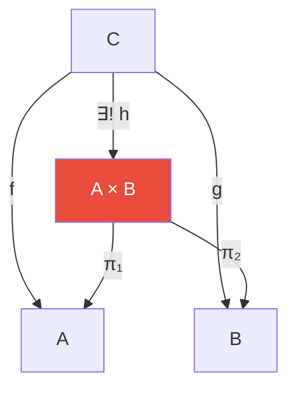

# 第18章 范畴论

> "范畴论是数学的数学"——它研究的不再是具体的数学对象，而是数学结构之间的**关系本身**。正如群论统一了对称性的各种表现，范畴论试图用"对象+箭头"的语言统一整个数学。

---

## 18.1 范畴：对象与箭头

### 定义

一个**范畴** $\mathcal{C}$ 由以下组成：

1. **对象**：$\text{Ob}(\mathcal{C})$ —— 如集合、群、拓扑空间
2. **态射**（箭头）：对每对对象 $A,B$，有态射集 $\text{Hom}(A,B)$
3. **复合**：$g \circ f : A \to C$（当 $f:A\to B$, $g:B\to C$）
4. **单位态射**：每个对象 $A$ 有 $\text{id}_A: A \to A$

满足：
- **结合律**：$(h \circ g) \circ f = h \circ (g \circ f)$
- **单位律**：$\text{id}_B \circ f = f = f \circ \text{id}_A$

### 范畴的实例

| 范畴 | 对象 | 态射 |
|------|------|------|
| $\mathbf{Set}$ | 集合 | 函数 |
| $\mathbf{Grp}$ | 群 | 群同态 |
| $\mathbf{Vect}_k$ | $k$-向量空间 | 线性映射 |
| $\mathbf{Top}$ | 拓扑空间 | 连续映射 |
| $\mathbf{Poset}$ | 偏序集 | 单调函数 |

> 每个范畴捕捉了一种"结构"和"保持结构的映射"——这正是 $\S$5 函数与映射一章中提到的统一视角的终极形式。

---

## 18.2 函子：范畴之间的映射

### 定义

**函子** $F: \mathcal{C} \to \mathcal{D}$ 同时映射对象和态射，并保持复合与单位：

$$
F(g \circ f) = F(g) \circ F(f), \quad F(\text{id}_A) = \text{id}_{F(A)}
$$

### 函子的例子

| 函子 | 从 | 到 | 做什么 |
|------|----|----|--------|
| 遗忘函子 | $\mathbf{Grp}$ | $\mathbf{Set}$ | 忘记群结构，只留元素集 |
| 自由群函子 | $\mathbf{Set}$ | $\mathbf{Grp}$ | 生成自由群 |
| 基本群 $\pi_1$ | $\mathbf{Top}_*$ | $\mathbf{Grp}$ | 拓扑→代数（$\S$7） |
| 同调 $H_n$ | $\mathbf{Top}$ | $\mathbf{Ab}$ | 拓扑空间→Abel群 |

> 函子是"结构保持的映射之间的映射"——它告诉我们一个数学领域如何转换为另一个领域的信息。这正是 $\S$5 中"映射的映射"——算子的范畴化。

---

## 18.3 自然变换：比较函子

如果函子是范畴之间的"映射"，**自然变换** $\alpha: F \Rightarrow G$ 就是两个函子之间的"映射"。

$$
\begin{CD}
F(A) @>{F(f)}>> F(B) \\
@V{\alpha_A}VV @VV{\alpha_B}V \\
G(A) @>>{G(f)}> G(B)
\end{CD}
$$

> **"自然"**这个日常用词在范畴论中有精确的技术含义：一个构造是"自然的"当它构成了函子之间的自然变换。例如，有限维向量空间 $V \cong V^{**}$ 是自然的，但 $V \cong V^*$ 不是。

---

## 18.4 泛性质：不用构造的"最优解"

范畴论最强大的思想之一是**泛性质**（universal property）——通过"它与其他一切的关系"来刻画一个对象，而不是通过"它内部由什么构成"。

### 积 (Product) 的泛性质

$A \times B$ 是满足以下泛性质的对象：存在投影 $\pi_1: A \times B \to A$，$\pi_2: A \times B \to B$，且对任意有态射 $f: C \to A, g: C \to B$ 的对象 $C$，存在唯一的态射 $h: C \to A \times B$ 使图表交换。

> 集合的 Cartesian 积、群的直积、拓扑空间的积都是这个**同一个范畴论概念在不同范畴中的实例**。泛性质统一了所有这些"积"概念。

### 对偶性：极限与余极限

| 概念 | 对偶概念 |
|------|---------|
| 积 (Product) | 余积 (Coproduct) |
| 拉回 (Pullback) | 推出 (Pushout) |
| 极限 (Limit) | 余极限 (Colimit) |
| 等化子 (Equalizer) | 余等化子 (Coequalizer) |

> 范畴论中的"对偶"——反转所有箭头——将一种构造变为另一种。这种对称性在 $\S$2 空间（开/闭集对偶）和 $\S$9 泛函分析（Banach空间的对偶）中已经出现。

---

## 18.5 Yoneda 引理——范畴论最深的结果

**Yoneda 引理**（粗略版）：一个对象完全由"所有其他对象到它的态射"所决定。

$$
\text{Nat}(\text{Hom}(-, A), F) \cong F(A)
$$

> 换句话说：**你不需要知道一个事物的内部结构——只需要知道它与宇宙中一切其他事物的关系，就能完整重建它的一切信息**。这是结构主义哲学的数学极致。

---

## 18.6 本章关键点汇总

| # | 关键概念 | 直觉 | 连接章节 |
|---|---------|------|---------|
| 1 | **范畴 = 对象 + 箭头** | 结构 + 保持结构的映射 | 全书统一语言 |
| 2 | **函子 = 范畴间的翻译** | 保持结构地转换领域 | $\S$7 $\pi_1$ |
| 3 | **自然变换** | 函子间的映射 | 高等代数 |
| 4 | **泛性质** | 不用内部构造的"最优"定义 | 统一积/余积 |
| 5 | **Yoneda引理** | 对象 = 它与其他一切的关系 | 结构主义哲学 |

> 💡 **核心哲学**：范畴论教给我们最重要的不是技术，而是一种**视角**——不要问"这个东西是什么"，而要问"这个东西与别的东西如何关联"。在这种视角下，群论、拓扑、线性代数不再是各自为政的领域，而是同一套结构逻辑在不同范畴中的实现。这就是"数学的数学"的含义。
