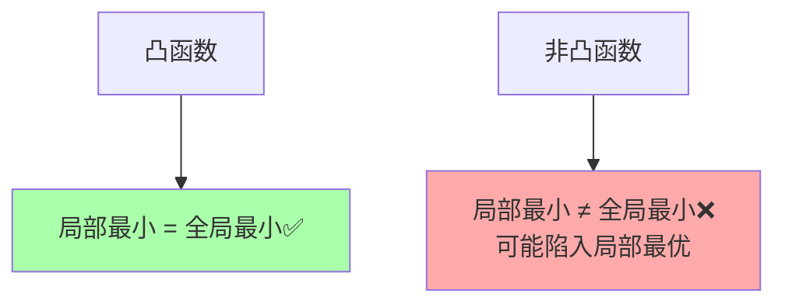

# 第19章 优化

> 优化是数学中最实用的分支——在约束条件下寻找最佳选择。从工程设计到机器学习训练，优化的方法和理论构成了现代科技的数学引擎。

---

## 19.1 最优化问题的统一框架

### 标准形式

$$
\begin{aligned}
\min_{x} \quad & f(x) \\
\text{s.t.} \quad & g_i(x) \leq 0, \quad i = 1,\ldots,m \\
& h_j(x) = 0, \quad j = 1,\ldots,p
\end{aligned}
$$

- $f$：目标函数（要最小化的量）
- $g_i \leq 0$：不等式约束
- $h_j = 0$：等式约束

---

## 19.2 凸性：为什么凸优化是"容易的"

### 凸集与凸函数

- **凸集**：集合中任意两点的连线仍在集合内
- **凸函数**：$f(\lambda x + (1-\lambda)y) \leq \lambda f(x) + (1-\lambda)f(y)$

### 凸优化的"免费午餐"

> 对凸优化问题，**任何局部最优解就是全局最优解**。

这使凸优化与一般非线性优化有着本质区别——你永远不会"陷入"局部极小值。



---

## 19.3 拉格朗日乘子与 KKT 条件

### 等式约束的 Lagrange 乘子

对于 $\min f(x)$ 满足 $h(x)=0$，构造 Lagrangian：

$$
\mathcal{L}(x, \lambda) = f(x) + \lambda h(x)
$$

必要条件：$\nabla_x \mathcal{L} = 0, \nabla_\lambda \mathcal{L} = 0$。

### KKT 条件（含不等式约束）

对于 $\min f(x)$ 满足 $g_i(x) \leq 0$：

1. **稳定性**：$\nabla f(x^*) + \sum \mu_i \nabla g_i(x^*) = 0$
2. **原始可行**：$g_i(x^*) \leq 0$
3. **对偶可行**：$\mu_i \geq 0$
4. **互补松弛**：$\mu_i \cdot g_i(x^*) = 0$

> 互补松弛条件告诉你：如果一个约束在最优解处是"松的"（$g_i(x^*) < 0$），那么它对最优解没有影响（$\mu_i = 0$）。

```python
import sympy as sp

# Lagrange 乘子法：max x+y s.t. x²+y²=1
x, y, lam = sp.symbols('x y lam')
f = x + y                    # 目标函数
g = x**2 + y**2 - 1          # 约束

L = f - lam * g              # Lagrangian

# 解 ∇L = 0
eqs = [sp.diff(L, x), sp.diff(L, y), sp.diff(L, lam)]
sol = sp.solve(eqs, [x, y, lam], dict=True)

print("Lagrange乘子法: max x+y s.t. x²+y²=1")
for s in sol:
    print(f"  x={s[x]:.4f}, y={s[y]:.4f}, λ={s[lam]:.4f}, f={float(s[x]+s[y]):.4f}")
```

---

## 19.4 梯度下降：数值优化的主力

### 基本迭代

$$
x_{k+1} = x_k - \eta \nabla f(x_k)
$$

- $\eta$：学习率（步长）
- $-\nabla f(x_k)$：最陡下降方向

### 变体比较

| 算法 | 更新规则 | 特点 |
|------|---------|------|
| **SGD** | $x_{k+1} = x_k - \eta \nabla f_{i}(x_k)$ | 每次用随机样本 |
| **Momentum** | $v_{k+1} = \beta v_k + \nabla f$ | 累积动量 |
| **Adam** | 自适应学习率 | 深度学习标配 |
| **Newton** | $x_{k+1} = x_k - H^{-1}\nabla f$ | 二阶收敛，$H$ 是 Hessian |

```python
import numpy as np

# 梯度下降：最小化 f(x) = x⁴ - 4x² + 2x
def f(x): return x**4 - 4*x**2 + 2*x
def grad_f(x): return 4*x**3 - 8*x + 2

x = 2.0  # 初始点
lr = 0.05
path = [x]

for _ in range(30):
    x = x - lr * grad_f(x)
    path.append(x)

print("梯度下降路径 (f(x)=x⁴-4x²+2x):")
for i, xi in enumerate(path[:10]):
    print(f"  第{i}步: x={xi:.4f}, f(x)={f(xi):.4f}")
print(f"  ... 收敛到 x*={x:.4f}")
```

---

## 19.5 对偶性

### 对偶问题的构造

原始问题（P）→ Lagrangian → 对偶函数 → 对偶问题（D）

**弱对偶**：$d^* \leq p^*$（对偶最优值 $\leq$ 原始最优值）

**强对偶**（凸 + Slater条件）：$d^* = p^*$

> 对偶性允许我们从另一角度求解——有时对偶问题比原始问题更容易。SVM 的对偶形式、LP 的对偶单纯形法都建立在此之上。

---

## 19.6 本章关键点汇总

| # | 关键概念 | 直觉 | 连接章节 |
|---|---------|------|---------|
| 1 | **凸性 → 局部=全局** | 凸优化是"安全的" | 理论保证 |
| 2 | **KKT条件** | 约束优化的最优性条件 | $\S$9 变分法 |
| 3 | **梯度下降** | 沿负梯度方向→下降 | ML/AI 核心算法 |
| 4 | **Lagrange乘子** | 约束→惩罚项 | $\S$12 变分法 |
| 5 | **对偶性** | 换个角度看同一问题 | 凸分析 |

> 💡 **核心哲学**：优化是"在限制中求最优"的艺术。KKT条件告诉我们最优解必须满足什么，凸性告诉我们什么时候解是唯一的，梯度下降告诉我们如何从任意起点走向最优——这三种视角（必要条件的、结构的、算法的）构成了优化的统一图景。
