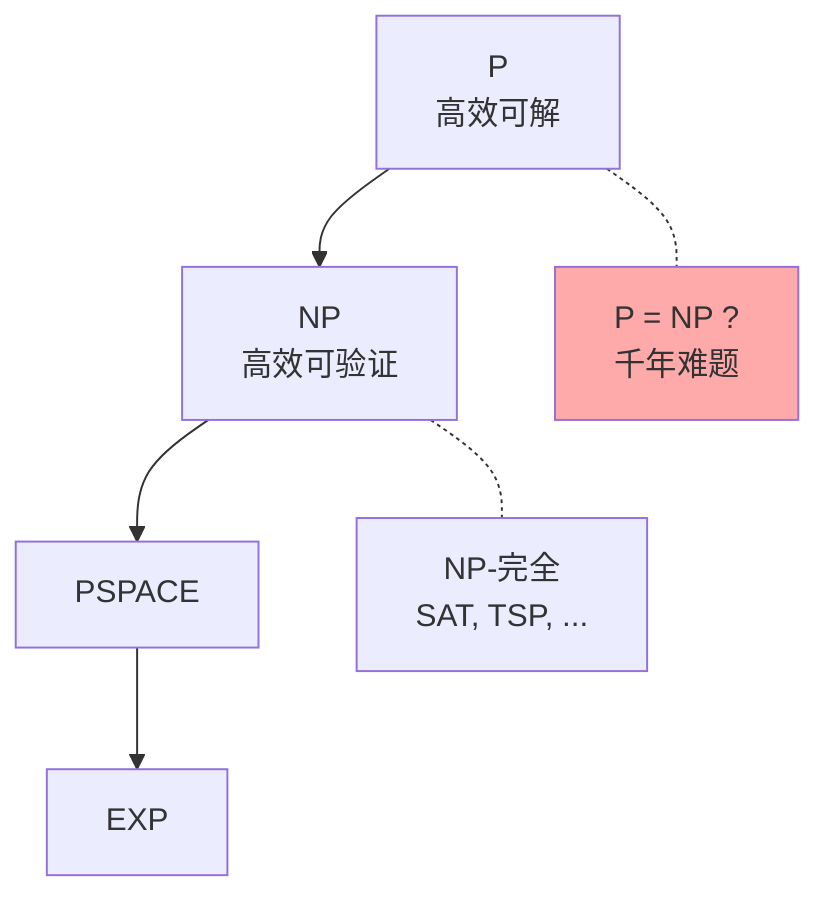

# 第20章 信息与计算

> 什么可以被计算？计算需要多少资源？信息的本质是什么？Turing、Shannon、Kolmogorov 等人在20世纪中期奠定的答案不仅改变了数学，更创造了整个数字文明。

---

## 20.1 算法：解决问题的有限步骤

### 什么是算法？

**算法** = 有限、明确、机械可执行的步骤序列，用于解决某一类问题。

### 算法的核心性质

| 性质 | 含义 |
|------|------|
| **有限性** | 有限步内终止 |
| **确定性** | 同一输入→同一输出 |
| **通用性** | 不依赖特定输入 |
| **可行性** | 每一步都可机械执行 |

### Turing 机：算法的数学定义

Turing 机 = 一条无限长纸带 + 一个有限状态控制器 + 读写头。

> **Church-Turing 论题**：任何"直观上可计算"的函数都可以被 Turing 机计算。这不是定理，而是对"可计算"这一非形式概念的精确刻画——至今未被任何反例动摇。

---

## 20.2 计算复杂度：什么是"快速"的？

### 复杂度类的层级

| 类 | 含义 | 例子 |
|----|------|------|
| **P** | 多项式时间可解 | 排序、最短路径 |
| **NP** | 多项式时间可验证 | SAT、旅行商 |
| **NP-完全** | NP中最难的问题 | 3-SAT、团问题 |
| **PSPACE** | 多项式空间 | 量化布尔公式 |
| **EXP** | 指数时间 | 围棋最优策略 |

### P vs NP —— 千禧年悬赏问题（$1,000,000）

> **P = NP？** —— 是否所有验证起来容易的问题，解起来也容易？

大多数计算机科学家相信 $\text{P} \neq \text{NP}$。如果 $\text{P} = \text{NP}$，密码学将崩溃（RSA 可被高效破解），蛋白质折叠和最优调度将变得简单。




---

## 20.3 信息熵：不确定性的度量

### Shannon 熵 (1948)

对于离散随机变量 $X$，取值为 $x_i$ 的概率为 $p_i$：

$$
H(X) = -\sum_i p_i \log_2 p_i \quad \text{（单位：比特）}
$$

| 熵 | 含义 |
|----|------|
| $H=0$ | 完全确定（$p=1$） |
| $H=1$ | 公平硬币——最大不确定性 |
| $H$ 越大 | 不确定性越大 |

### 信息论的核心定理

| 定理 | 陈述 |
|------|------|
| **信源编码** | 数据可压缩到熵的极限：$H(X)$ 比特/符号 |
| **信道编码** | 在噪声信道中可靠传输的速率上限 = 信道容量 $C$ |
| **互信息** | $I(X;Y)=H(X)-H(X\mid Y)$ = $Y$ 告诉我们多少关于 $X$ 的信息 |

```python
import numpy as np
import math

def entropy(probabilities):
    """计算 Shannon 熵"""
    p = np.array(probabilities)
    p = p[p > 0]  # 去掉零概率
    return -np.sum(p * np.log2(p))

# 公平硬币: 1 bit
print(f"公平硬币: H = {entropy([0.5, 0.5]):.2f} bits")
# 不公平硬币: < 1 bit
print(f"偏硬币 p(heads)=0.9: H = {entropy([0.9, 0.1]):.2f} bits")
# 确定事件: 0 bit
print(f"确定事件: H = {entropy([1.0, 0.0]):.4f} bits")

# Huffman 编码的简单演示
from collections import Counter
text = "this is an example of a huffman tree"
freq = Counter(text)
# 按频率排序
sorted_freq = sorted(freq.items(), key=lambda x: -x[1])
print(f"\n'{text[:30]}...' 的字符频率:")
for char, count in sorted_freq[:8]:
    print(f"  '{char}': {count}次")
```

---

## 20.4 编码理论

### 三大目标

| 目标 | 方法 | Shannon定理 |
|------|------|------------|
| **压缩** | Huffman, LZW, 算术编码 | 极限 = 熵 |
| **纠错** | Hamming, Reed-Solomon, LDPC | 可靠传输速率 ≤ 信道容量 |
| **加密** | AES, RSA, ECC | 计算安全性 |

### 纠错码的几何直觉

码字之间需要足够的 Hamming 距离 → 即使某些位出错仍能恢复。

最小距离 $d$ 的码可以：
- 检测 $\leq d-1$ 个错误
- 纠正 $\leq \lfloor(d-1)/2\rfloor$ 个错误

---

## 20.5 Kolmogorov 复杂度

### 定义

一个字符串的 **Kolmogorov 复杂度** $K(x)$ = 能输出 $x$ 的最短程序的长度。

> 这是"随机性"的严格定义——如果 $K(x) \approx |x|$（字符串长度），则 $x$ 是**算法随机的**（不可压缩）。

### 与 Gödel 的联系

Kolmogorov 复杂度为 Gödel 不完备定理（$\S$17）提供了信息论的新证法：$K(x)$ 在大多数 $x$ 上是**不可计算的**——否则会产生 "Berry 悖论"式的矛盾。

---

## 20.6 本章关键点汇总

| # | 关键概念 | 直觉 | 连接章节 |
|---|---------|------|---------|
| 1 | **Turing机** | 算法的精确数学模型 | $\S$17 逻辑 |
| 2 | **P vs NP** | 求解 vs 验证的天壤之别 | 计算理论 |
| 3 | **Shannon熵** | 不确定性的量化 | $\S$14 概率 |
| 4 | **信道容量** | 噪声信道的传输极限 | 通信工程 |
| 5 | **纠错码** | 几何 = 码字间距 | $\S$2 度量 |
| 6 | **Kolmogorov复杂度** | 随机性 = 不可压缩性 | $\S$17 Gödel |

> 💡 **核心哲学**：20世纪的三位巨人——Turing（什么是可计算的）、Shannon（什么是信息）、Kolmogorov（什么是随机的）——共同回答了一个根本问题：**在本质上，什么可以被机器处理，什么不能？** 他们的答案划定了算法世界的疆界，告诉我们——即使再过一千年，有些东西仍然是原则上不可计算、不可压缩的。这不是技术的限制，而是宇宙的逻辑结构本身。
