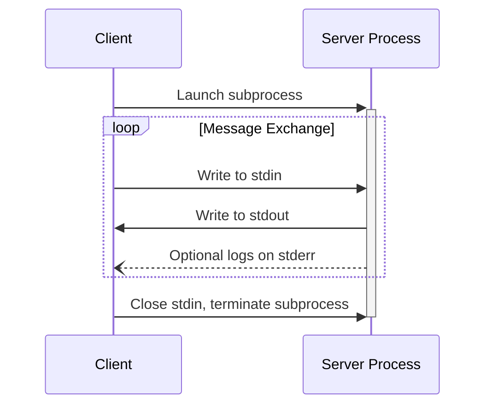
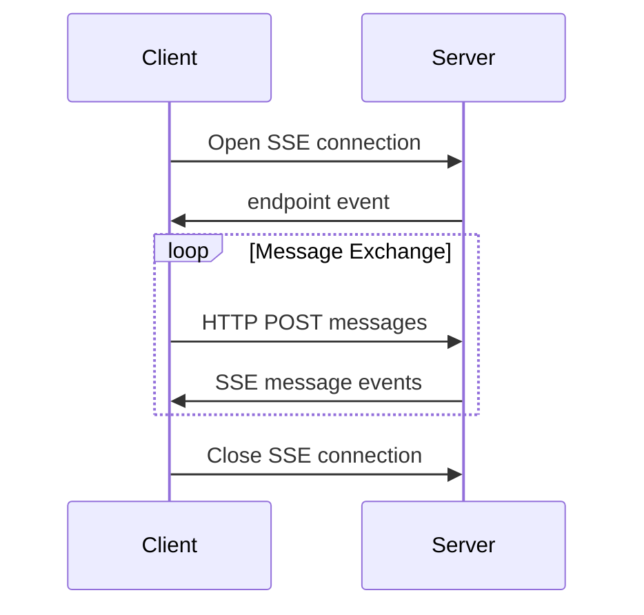

# Model Context Protocol specification 2024-11-05 - Transports

## Source Snapshot

---
title: Transports
type: docs
weight: 40
---

MCP currently defines two standard transport mechanisms for client-server communication:

1. [stdio](#stdio), communication over standard in and standard out
2. [HTTP with Server-Sent Events](#http-with-sse) (SSE)

Clients **SHOULD** support stdio whenever possible.

It is also possible for clients and servers to implement
[custom transports](#custom-transports) in a pluggable fashion.

## stdio

In the **stdio** transport:

- The client launches the MCP server as a subprocess.
- The server receives JSON-RPC messages on its standard input (`stdin`) and writes
  responses to its standard output (`stdout`).
- Messages are delimited by newlines, and **MUST NOT** contain embedded newlines.
- The server **MAY** write UTF-8 strings to its standard error (`stderr`) for logging
  purposes. Clients **MAY** capture, forward, or ignore this logging.
- The server **MUST NOT** write anything to its `stdout` that is not a valid MCP message.
- The client **MUST NOT** write anything to the server's `stdin` that is not a valid MCP
  message.

## HTTP with SSE

In the **SSE** transport, the server operates as an independent process that can handle
multiple client connections.

#### Security Warning

When implementing HTTP with SSE transport:

1. Servers **MUST** validate the `Origin` header on all incoming connections to prevent DNS rebinding attacks
2. When running locally, servers **SHOULD** bind only to localhost (127.0.0.1) rather than all network interfaces (0.0.0.0)
3. Servers **SHOULD** implement proper authentication for all connections

Without these protections, attackers could use DNS rebinding to interact with local MCP servers from remote websites.

The server **MUST** provide two endpoints:

1. An SSE endpoint, for clients to establish a connection and receive messages from the
   server
2. A regular HTTP POST endpoint for clients to send messages to the server

When a client connects, the server **MUST** send an `endpoint` event containing a URI for
the client to use for sending messages. All subsequent client messages **MUST** be sent
as HTTP POST requests to this endpoint.

Server messages are sent as SSE `message` events, with the message content encoded as
JSON in the event data.

## Custom Transports

Clients and servers **MAY** implement additional custom transport mechanisms to suit
their specific needs. The protocol is transport-agnostic and can be implemented over any
communication channel that supports bidirectional message exchange.

Implementers who choose to support custom transports **MUST** ensure they preserve the
JSON-RPC message format and lifecycle requirements defined by MCP. Custom transports
**SHOULD** document their specific connection establishment and message exchange patterns
to aid interoperability.

## Research Notes

- 角色：AI 域知识网络的一手规范锚点（T0）。定义 MCP 2024-11-05 版仅有的两种标准 transport：stdio 与 HTTP with SSE。
- 与其他 sourceId 的关系：被 ai-mcp-pr206-002（PR #206，Streamable HTTP）在 2025-03-26 版规范中 SUPERSEDES（其中 /sse 端点被移除）；ai-mcp-latent-003 与 ai-mcp-hn-004 对该协议的意义与设计做二手评论。
- 事实/观点区分：全文为规范性文本（fact，规范性 MUST/SHOULD 语句），无作者个人观点。
- 获取方式与限制：raw.githubusercontent.com 超时，改用 GitHub Contents API（base64）获取，固定 commit。发布日 2024-11-05 取自规范版本号本身；该文件在仓库中的首次提交日期未核实（uncertainty）。
- 许可：仓库文档为 MIT 许可，全文保存合法。
